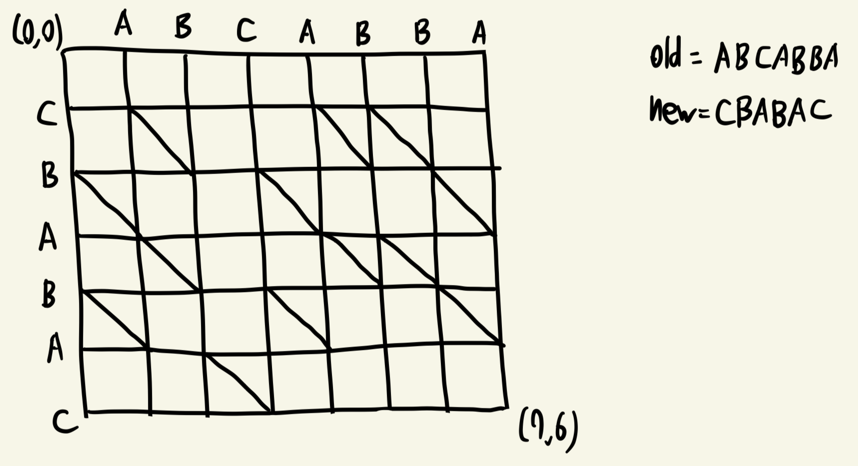
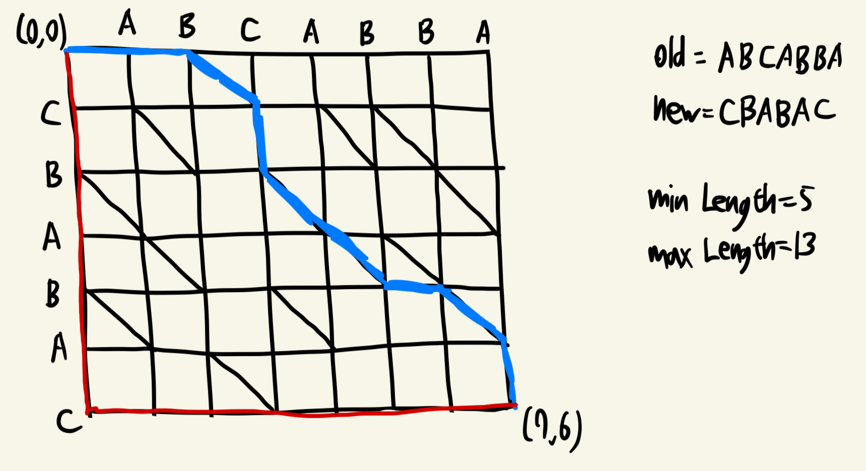

## DiffUtil의 역할

- 두 개의 리스트(old, new)를 비교하여 "최소한의 변경 내역"을 계산하고, RecyclerView에 전달하는 것
- notifyDataSetChanged()를 사용하면 전체 리스트를 새로 그림 -> 깜빡임 + 성능 저하
- 하지만 실제로는 몇 개 아이템만 바뀌었을 뿐일 때가 많음 -> DiffUtil은 "어떤 아이템이 추가/삭제/이동/변경됐는지"를 찾아내서 그 부분만 업데이트

## Myers의 Shortest Edit Script(SES) 알고리즘

- 목표
  - 삽입+삭제 최소 횟수 D를 찾는 것(=Shortest Edit Script)
  - 시간 복잡도: O((n+m)·D) - 리스트가 커도 변경이 적으면(D가 작으면) 매우 빠름
- 용어 정리
  - n = old 시퀀스의 길이
  - m = new 시퀀스의 길이
  - (x, y) = old에서 x개, new에서 y개를 소비한 상태
  - d = 허용 연산 수(삽입+삭제)
  - k = 대각선 번호(x-y), old와 new의 진행 차이를 의미
  - furthest-reaching x = 대각선 k에서 도달 가능한 가장 먼 x 좌표
  - 스네이크 확장: old와 new 문자가 일치하는 동안 연속적으로 유지되는 대각선 keep 구간
- 방법
  1. 편집거리 d를 0, 1, 2... 순서대로 늘려가며 탐색
  2. 대각선 k = x - y를 정의
  3. 각 대각선마다 `현재까지 도달 가능한 가장 먼 x 좌표`만 기록
     - `가장 멀리 간 점`만 알면 그 이후 경로는 그 지점에서 파생되므로, 전체 DP 테이블 불필요
  4. 한 칸 삽입(insert) 또는 삭제(delete)로 대각선 위로 도착한 다음, old[x] == new[y]라면 계속 대각선으로 이동
  5. 이렇게 d를 늘려가면서 대각선별 furthest-reaching x를 갱신하다가 어느 순간 (n, m)에 도달하면 그때의 d가 최소 편집 거리(=Shortest Edit Script)

### 시각화

old = [A, B, C, A, B, B, A] -> new = [C, B, A, B, A, C]로 바뀔 때를 편집 그래프로 시각화하면



#### Before

- 화살표:
  - 대각선(keep): 같은 아이템 유지
  - 오른쪽(delete): old에서 삭제
  - 아래(insert): new에 삽입



#### After

- 파란 경로 = 최단 편집 경로. 파란 경로의 대각선(스네이크)가 길수록 바뀌지 않은 구간이 길다 -> UI 변경 최소화

## 코드

```kotlin
/**
 * Myers O(ND) 알고리즘을 이용해 편집거리(삽입+삭제 최소 횟수)만 계산한다.
 * - old: 원본 시퀀스
 * - new: 변경된 시퀀스
 * - eq : 동등성 비교 함수 (기본 ==)
 *
 * 반환값 D: old -> new로 바꾸기 위해 필요한 "삽입+삭제"의 최소 횟수
 *
 * 구현 포인트
 * - V[k] : 대각선 k(x - y)에 대해 "도달 가능한 가장 먼 x"를 저장
 * - d(허용 편집 횟수)를 0..max 까지 증가시키며, 각 d에서 가능한 모든 k를 갱신
 * - 매 스텝에서 "스네이크(= 연속 대각선: 일치 구간)"를 최대한 확장
 * - (x, y)가 (n, m)에 도달하면 해당 d가 최소 편집거리이므로 바로 반환
 */
fun <T> myersEditDistance(
    old: List<T>,
    new: List<T>,
    eq: (T, T) -> Boolean = { a, b -> a == b }
): Int {
    val n = old.size
    val m = new.size
    // 두 시퀀스가 비면 빠른 반환
    if (n == 0) return m // 모두 삽입
    if (m == 0) return n // 모두 삭제

    // Myers의 V 배열: 인덱싱 편의를 위해 offset 사용
    val max = n + m
    val offset = max
    val v = IntArray(2 * max + 1) { 0 } // v[k]: 대각선 k(x-y)에서의 furthest-reaching x

    // d = 허용 편집거리(삽입+삭제 횟수)
    for (d in 0..max) {
        // k는 x - y (대각선 인덱스), d 스텝에서 가능한 k는 -d, -d+2, ..., d-2, d
        var k = -d
        while (k <= d) {
            // 두 후보 중 하나를 택해 한 칸 전진(오른쪽=삭제 or 아래=삽입)
            // chooseDown == true 면 아래로(삽입), false면 오른쪽(삭제)
            val kIndexMinus = offset + (k - 1)  // 삭제에서 왔을 때 참조하는 대각선
            val kIndexPlus = offset + (k + 1)   // 삽입에서 왔을 때 참조하는 대각선
            val chooseDown =
                (k == -d) || (k != d && v[kIndexMinus] < v[kIndexPlus])

            // x 시작점 선택
            var x = if (chooseDown) {
                v[kIndexPlus]              // 아래로 내려온 경우: x 그대로
            } else {
                v[kIndexMinus] + 1         // 오른쪽으로 간 경우: x + 1
            }
            var y = x - k

            // 스네이크(연속 대각선: 일치 구간) 최대 확장
            while (x < n && y < m && eq(old[x], new[y])) {
                x++; y++
            }

            // 해당 대각선 k에서의 "가장 먼 x" 갱신
            v[offset + k] = x

            // 종착점 도달 여부 검사
            if (x >= n && y >= m) {
                // 현재 d가 최소 편집거리
                return d
            }

            k += 2
        }
    }
    // 이 지점까지 오지 않음(논리상 도달 전 반환됨)
    return max
}
```

## DiffUtil은 여기서 무엇을 더 할까?

1. 2nd pass(이동 감지)
   - SES 결과는 keep / delete / insert만 존재
   - DiffUtil은 남은 delete와 insert 쌍을 훑어 areItemsTheSame(old, new)가 true라면
   - delete + insert -> move로 승격
   - notifyItemMoved(from, to)를 호출해 삭제·삽입 대신  부드러운 이동 애니메이션 구현
2. 역순 디스패치 + 인덱스 조정
   - 업데이트는 뒤에서 앞으로(reverse) 내보내야 앞쪽 아이템들의 인덱스가 흔들리지 않음
   - 삭제/삽입 같은 연산은 PostponedUpdate 큐에 임시로 보관
   - 이후 다른 연산에서 동일한 아이템을 만나면 매칭해 move로 승격하거나, 끝까지 매칭되지 않으면 remove/insert로 확정
   - 이 과정을 통해 이미 수행된 삽입/삭제로 인한 인덱스 변화를 보정하면서
   - notiftyItemRemoved/Inserted/Moved/Changed를 정확한 위치에 최소 호출로 디스패치