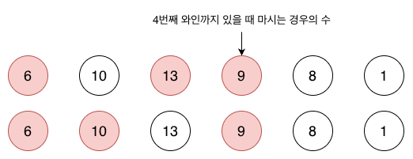
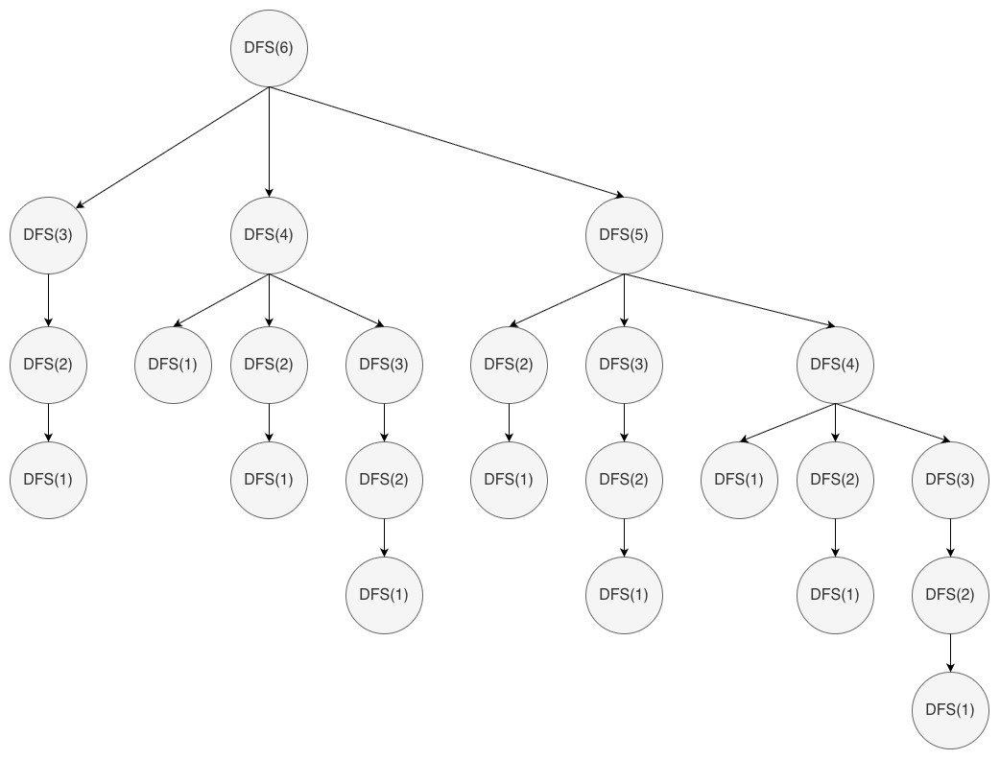

## DFS 알고리즘이란?

DFS(Depth First Search, 깊이 우선 탐색)은 `모든 경우의 수를 깊이 우선으로 탐색`하는 알고리즘이다.
트리나 그래프 같은 구조에서 한 방향으로 끝까지 탐색한 뒤, 더 이상 갈 곳이 없을 때 되돌아가(backtracking) 다른 경로를 탐색한다.

하지만 DFS에는 치명적인 단점이 있다.
서로 다른 경로를 탐색하는 과정에서 `동일한 부분 문제(subproblem)`이 여러 번 반복 계산될 수 있다.

이를 메모이제이션을 통해 개선할 수 있다.

## 메모이제이션이란?

메모이제이션(Memoization)은 `이미 계산한 결과를 저장하고, 같은 입력에 대해 다시 계산하지 않는 기법`이다.
즉, DFS를 그대로 사용하되 한 번 계산한 결과는 저장해두고 같은 입력에 대해서는 다시 계산하지 않을 수 있다.

이를 `Top-Down Dynamic Programming(하향식 DP)` 이라고 한다.
DFS의 재귀 구조는 그대로 유지하되, DP의 중복 계산 방지 효과를 더한 형태다.

## 문제 적용 - 백준 2156번: 포도주 시식

문제 링크: [https://www.acmicpc.net/problem/2156](https://www.acmicpc.net/problem/2156)

### 문제 요약

- N개의 포도주 잔이 일렬로 놓여 있다.
- 3잔 연속으로 마실 수 없다.
- 마실 수 있는 포도주의 최대 양을 구하라

## DFS 버전

`dfs(i)`를 i번째 와인까지 고려했을 때 마실 수 있는 최대 양이라고 정의해보자.
이때 가능한 경우의 수는 3가지다.



1. `i`번째 와인과 `i-1`번째 와인을 마시고, `i-2`번째는 건너뛴다 → `dfs(i-3) + wines[i-1] + wines[i]`
2. `i`번째 와인만 마시고, `i-1`번째는 건너뛴다 → `dfs(i-2) + wines[i]`
3. `i`번째 와인을 아예 마시지 않는다 → `dfs(i-1)`

이 중 가장 큰 값을 선택하면 된다.

```kotlin
fun main() {
    val br = BufferedReader(InputStreamReader(System.`in`))
    val n = br.readLine().toInt()
    val wines = mutableListOf(0)

    repeat(n) {
        wines.add(br.readLine().toInt())
    }

    br.close()

    fun dfs(i: Int): Int {
        when (i) {
            1 -> {
                return wines[1]
            }
            2 -> {
                return dfs(1) + wines[2]
            }
            3 -> {
                return max(wines[1] + wines[3], dfs(2))
            }
            else -> return maxOf(
                dfs(i - 3) + wines[i - 1] + wines[i],
                dfs(i - 2) + wines[i],
                dfs(i - 1)
            )
        }
    }

    println(dfs(n))
}
```

예를 들어 와인이 [6, 10, 13, 9, 8, 1]이 있고 해당 와인들을 최대로 마실 수 있는 양을 구하면 아래와 같은 재귀 호출이 발생한다.



- dfs(6)은 dfs(3), dfs(4), dfs(5)을 호출한다.
- dfs(5)는 다시 dfs(2), dfs(3), dfs(4)를 호출한다.
- ....

결과적으로 동일한 함수가 중복 호출되며 이러한 구조는 시간복잡도가 지수 시간 (O(3ⁿ)) 으로 매우 비효율적이다.

## DFS + DP(메모이제이션) 버전

이제 dp 배열을 사용해 이미 계산한 결과를 저장하고 재활용하도록 개선하자.
여기서 dp[i]는 i번째 와인까지 마실 수 있는 최대 포도주 양을 의미한다.

```kotlin
fun main() {
    val br = BufferedReader(InputStreamReader(System.`in`))
    val n = br.readLine().toInt()
    val wines = mutableListOf(0)
    val dp = IntArray(n + 1) { -1 }

    repeat(n) {
        wines.add(br.readLine().toInt())
    }

    br.close()

    fun dfs(i: Int): Int {
        if (i <= 0) return 0
        if (dp[i] != -1) return dp[i]

        dp[i] = when (i) {
            1 -> {
                wines[1]
            }
            2 -> {
                dfs(1) + wines[2]
            }
            else -> {
                maxOf(
                    dfs(i - 3) + wines[i - 1] + wines[i],
                    dfs(i - 2) + wines[i],
                    dfs(i - 1)
                )
            }
        }

        return dp[i]
    }

    println(dfs(n))
}
```

매 DFS 함수 호출 시 마다 호출 결과를 DP에 저장하고 다음 호출 때는 이미 계산된 값을 사용하는 형태이다.


빨강색 노드는 이미 계산되어 재호출이 생략된 부분을 의미한다.

1. dfs(6)은 dfs(3), dfs(4), dfs(5)을 호출한다.
2. dfs(3)은 dfs(2), dfs(1)을 호출한다.
3. dfs(4)는 이미 계산된 dp[1], dp[2], dp[3]의 값을 활용한다.
4. dfs(5)도 이미 계산된 dp[2], dp[3], dp[4]의 값을 활용한다.

DFS만 사용했을 때는 dfs(6)을 호출하면 총 24번의 계산이 이루어진 반면,
DFS+Memoization 사용 시 각 i에 대해 한 번만 계산하기 때문에 dfs(6) 호출 시 총 6번의 계산이 이루어진다.

## 결론

DFS는 단순하고 직관적이지만, 중복 계산이 많아 비효율적이다. 메모이제이션을 결합하면 중복 계산을 줄일 수 있다.
DP를 통해서 풀어야 하는 문제가 나온다면, 우선 DFS나 완전 탐색으로 먼저 풀어보고 부분 문제를 찾아내 메모이제이션으로 최적화하는 접근도 것도 한가지 방법일 것 같다.
