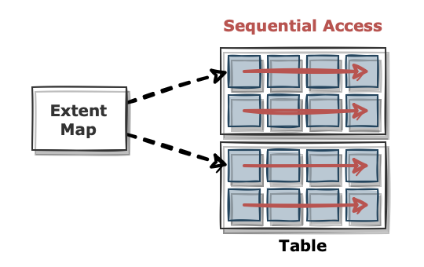
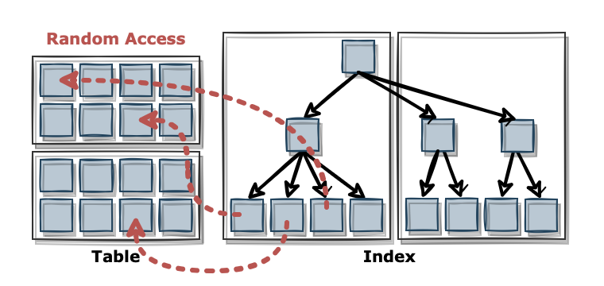

## 1. Table Full Scan (테이블 전체 스캔)



### 의미

- 테이블의 모든 블록(모든 행)을 처음부터 끝까지 순차적으로 읽는 방식

### 작동 방식

1. DB Buffer Cache 확인하여 없다면 디스크에서 읽음
2. Multi-block I/O로 여러 블록을 한 번에 가져옴
3. 각 행을 WHERE 조건절과 비교하여 만족하는 행만 결과 

### 용도

- 테이블이 작아서 전체를 읽는 것이 더 빠를 때
  - 인덱스 트리를 타는 비용보다 곧바로 모든 블록을 읽는 것이 더 효율적일 때
- 조건절이 인덱스를 타지 못할 때
  - 인덱스 컬럼에 함수/연산이 적용되었을 때
    ```sql
    SELECT * FROM member WHERE age + 1 = 30;
    SELECT * FROM member WHERE SUBSTR(name, 1, 1) = 'A';
    ```
    - age + 1은 인덱스 트리에 저장된 값이 아니므로 인덱스 스캔 불가
  - 와일드카드 패턴이 앞에 올 때
    ```sql
    SELECT * FROM member WHERE name LIKE '%son';
    ```
    - 인덱스는 "앞에서부터 정렬된 값"만 활용 가능
    - '%son'은 뒤에 son이 오는 모든 이름을 찾는 것이라 인덱스 활용 불가
- 결과 집합이 테이블의 상당수를 차지할 때
  - 전체 행의 30~40% 이상을 읽어야 한다면, 인덱스를 통해 테이블 블록을 점프하는 것보다 한 번에 쭉 읽는 것이 빠름

### 장점

- 조건절이나 인덱스 유무에 상관없이 항상 결과 가능
  - 인덱스가 없거나 인덱스를 못 타는 경우에도 안전하게 수행
- Sequential + Multi-block I/O로 대량 읽기에 유리
  - 디스크에서 연속된 블록을 한 번에 읽어오기 때문에 I/O 오버헤드가 적음

### 단점

- 대규모 테이블에서 불필요한 데이터까지 읽어야 하기 때문에 비용 발생
  - 필요한 데이터가 1%인데도 100%를 읽는다면 낭비
- 선택도가 높은(=소수의 결과만 필요한) 쿼리에는 비효율적
  - 1건만 찾을 때도 전체를 읽으므로 매우 느림

## 2. Index Range Scan (인덱스 범위 스캔)



### 의미

- B-Tree 인덱스를 이용해 특정 범위 조건에 맞는 엔트리만 순차적으로 탐색하는 방식

### 작동 방식

1. 인덱스 Root -> Branch -> Leaf 탐색
2. Leaf Node에서 조건 시작 위치 찾음
3. 이후 Leaf Node 순차 스캔하여 ROWID 획득
4. 테이블 블록 접근 (필요 시, Single Block I/O)

### 용도

- WHERE age BETWEEN 20 AND 30 처럼 범위 조건
  - B-Tree 구조에서 특정 구간만 읽어낼 수 있으므로 효율적
- LIKE 'abc%' 형태 (접두사 검색)
  - 정렬된 순서를 활용할 수 있음
- 인덱스 선두 컬럼을 활용한 조회
  - 복합 인덱스 (name, age)에서 선두 컬럼(name)부터 조건이 있어야만 정렬 순서를 탈 수 있음

### 장점

- 필요한 데이터 범위만 읽어서 불필요한 I/O를 최소화
  - 전체 1억 건 중 1만 건만 필요하다면 인덱스가 압도적으로 효율적
- 대규모 테이블에서도 선택도가 높으면 빠름

### 단점

- 범위가 넓으면 결국 많은 블록을 접근해야 함
  - 인덱스 기반 탐색이지만 최종적으로 테이블 전체의 절반 이상을 가져온다면 Full Scan이 더 나을 수 있음
- 인덱스 외 컬럼이 필요하면 테이블 액세스 발생
  - 인덱스의 Leaf Node는 (키 값 + ROWID)만 저장하므로, 다른 컬럼이 필요하면 테이블 블록을 추가로 읽어야 함
  - 이 과정에서 디스크의 여러 위치를 점프하며 읽게 되므로 랜덤 I/O가 발생
  - 즉 인덱스 자체는 순차적이지만, ROWID를 따라가는 과정이 비순차적임
- 캐시 효율이 떨어질 수 있음
  - 점프하면서 읽기 때문에 버퍼 캐시에 같은 블록이 잘 안 남음. 반복 조회에 비효율적