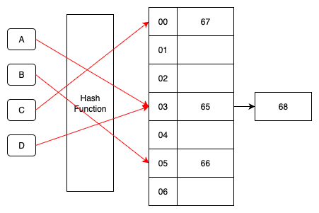
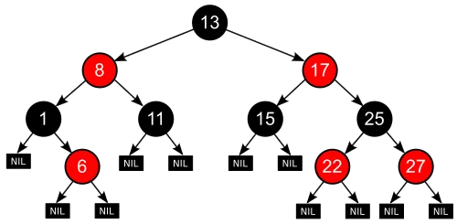
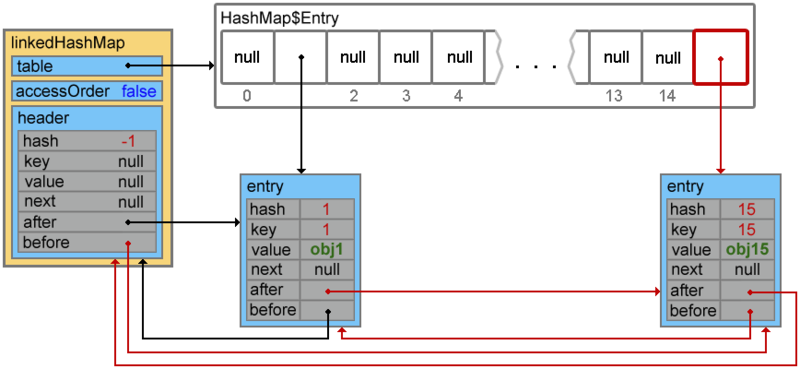

### 1. Set란?

- 중복을 허용하지 않는 컬렉션 인터페이스
- 순서 보장 여부는 구현체마다 다름

```kotlin
interface Set<E> : Collection<E> {
    fun add(e: E): Boolean
    fun contains(e: E): Boolean
    fun iterator(): MutableIterator<E>
}
```

### 2. HashSet

#### 특징
- 가장 빠른 평균 성능(O(1))의 포함/추가/삭제 연산
- 반복 순서 보장 없음
- null 허용 (중복 요소가 없어야 되므로 최대 1개 까지만)
- equals/hashCode 규악을 지켜야 정확히 동작

#### 내부 구현



- 구조: 내부에 HashMap 사용. 값은 상수 PRESENT
- 충돌 해결: 같은 버킷은 단일 연결 리스트로 체인.
  - 체인이 길어지면 버킷 단위 Red-Black Tree화
  - TREEIFY_THRESHOLD = 8
  - 단, 테이블 용량 < 64면 트리화 대신 리사이즈로 추돌 완화
  - 줄어들면 UNTREEIFY_THRESHOLD = 6에서 리스트로 되돌림
- 리사이즈: size > capacity * loadFactor (기본 0.75) -> 용량 2배
  - split 재배치 최적화: 각 노드는 기존 인덱스 i 또는 i + oldCap로만 이동

```kotlin
class HashSet<E> : MutableSet<E> {
    private val PRESENT = Any()
    private val map = HashMap<E, Any>()
    
    override fun add(element: E): Boolean = map.put(element, PRESENT) == null
    
    override fun contains(element: E): Boolean = map.containsKey(element)
    
    override fun remove(element: E): Boolean = map.remove(element) != null
}
```

#### 주요 연산 성능
- add, remove, contains: 평균 O(1), 최악 O(n), 트리화 시 O(log n)
- 반복(iteration): O(n) (순서 무관)

### 3. TreeSet

#### 특징
- 자연 순서 또는 Comparator에 따른 정렬 순서 유지
- 범위/탐색 연산 제공: first/last, ceiling/floor/higher/lower, subSet/headSet/tailSet
- 일반적으로 null 허용 안 함

#### 내부 구현



- Red-Black Tree (Balanced Binary Search Tree) 기반
- TreeSet<E>는 내부적으로 TreeMap<E, *> 사용
- 동치성 기준: compare(a, b) == 0 이면 "같은 원소"로 간주(중복 삽입 안 됨)
  - equals와 불일치하면 Set 규약 위반처럼 보이는 버그가 발생할 수 있음

```kotlin
class TreeSet<E>(private val cmp: Comparator<in E>? = null) : MutableSet<E> {
    private val tree = TreeMap<E, Any?>(cmp)
    private val PRESENT = Any()

    override fun add(e: E) = (tree.put(e, PRESENT) == null)
    override fun contains(e: E) = tree.containsKey(e)
    override fun remove(e: E) = (tree.remove(e) != null)

    fun ceiling(e: E): E? = tree.ceilingKey(e)
    fun floor(e: E): E? = tree.floorKey(e)
    // ...
}
```

#### 주요 연산 성능
- add, remove, contains: O(log n)
- 범위·탐색 연산: O(log n)
- 반복: O(n) (정렬 순서)

### 4. LinkedHashSet

#### 특징
- 삽입 순서 유지 + 평균 성능은 HashSet와 유사(O(1))
- Kotlin의 setOf/mutableSetOf 기본 구현체
- null 허용 (중복 요소가 없어야 되므로 최대 1개 까지만)

#### 내부 구현

- HashSet + 이중 연결 리스트 구조를 통해 반복 순서(삽입 순서)를 보존

```kotlin
class LinkedHashSet<E> : MutableSet<E> {
    private val PRESENT = Any()
    private val map = LinkedHashMap<E, Any?>()
    
    override fun add(e: E) = map.put(e, PRESENT) == null
    override fun contains(e: E) = map.containsKey(e)
    override fun remove(e: E) = map.remove(e) != null
}
```

#### 주요 연산 성능
- add, remove, contains: 평균 O(1)
- 반복: O(n) (삽입 순서 유지)
- 링크 비용으로 인해 메모리 오버헤드는 HashSet보다 조금 더 큼

### 5. 각 Set를 어떤 상황에 쓰는 것이 유리한가?

| 용도 / 상황 | 권장 Set | 핵심 이유 | 대표 예시 |
|---|---|---|---|
| 중복 제거 + 순서 불필요 + 최속 membership | HashSet | 해시 기반으로 평균 `add/contains/remove` O(1) | 방문 체크, 필터 집합, 대량 중복 제거 파이프라인 |
| 중복 제거 + 삽입 순서 유지 | LinkedHashSet | 해시 성능 유지 + 이중 연결 리스트로 **삽입 순서 보존** | UI 출력 순서 고정, 최근 추가 항목을 입력 순서대로 보여주기 |
| 정렬/범위 질의가 핵심 | TreeSet | Red-Black Tree로 항상 정렬 유지 + `ceiling/floor/subSet` 등 범위 연산 지원 | 가장 가까운 값 찾기, 구간 필터링, 항상 정렬된 출력 |