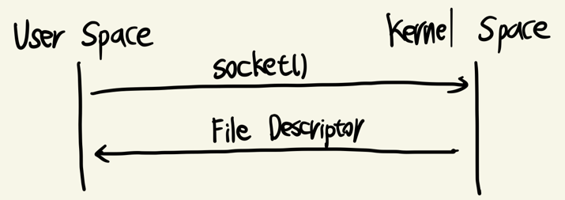
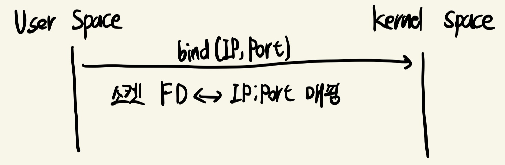
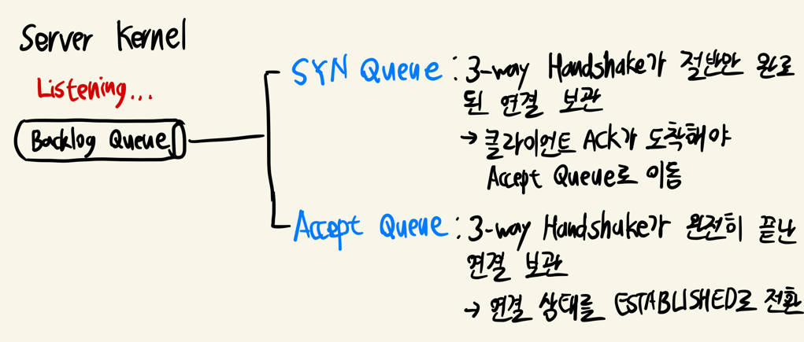
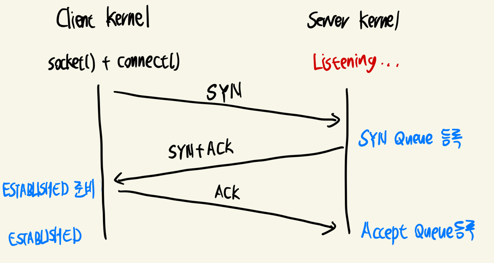
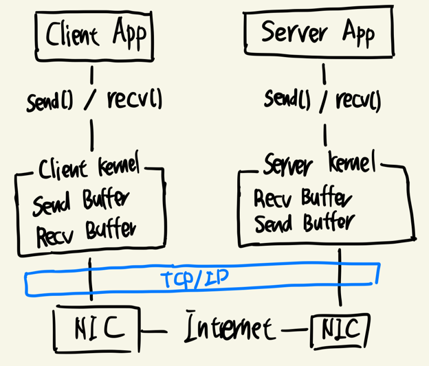
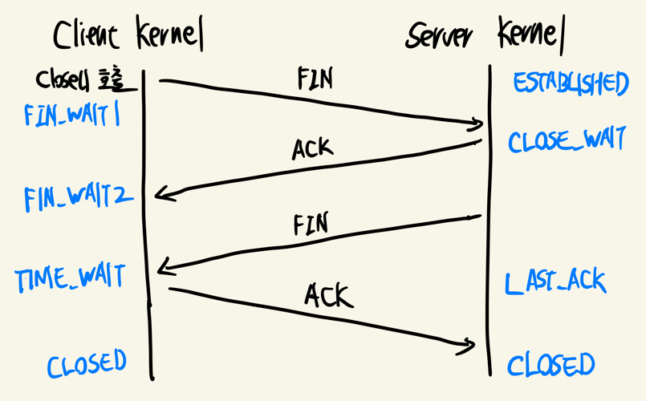

## 1. 소켓(Socket)이란?

- 소켓은 네트워크 통신의 엔드포인트
- 프로세스가 네트워크를 통해 데이터를 주고받기 위해 사용하는 인터페이스
- 운영체제는 소켓을 File Descriptor 형태로 관리하며, read/write와 유사한 방식으로 다룸

## 2. TCP 소켓 연결 과정

### 1. 소켓 생성과 바인딩

#### 1. socket() 호출

- 프로세스가 커널에 소켓 생성 요창
- 커널은 `소켓 구조체(socket struct)`를 생성하고 `File Descriptor`를 반환
- 소켓은 `프로토콜 제어 블록(PCB, Protocol Control Block)`을 통해 TCP/UDP 스택과 연결됨

#### 2. bind() 호출

- 특정 IP/포트에 소켓을 바인딩
- 커널은 포트 관리 테이블에 해당 포트를 등록
- 포트가 이미 사용 중이면 EADDRINUSE 오류 발생

### 2. 서버 측 준비 (listen)

- 서버가 listen() 호출 시
  - 커널은 소켓을 수동 대기(listening) 상태로 전환
  - 연결 요청을 저장하기 위한 `백로그 큐(backlog queue)` 생성
    - SYN Queue (반쯤 열린 연결): SYN 수신 후 아직 완료되지 않은 연결
      - 미완성 연결을 짧게 보관하다가 timeout 시 제거
    - Accept Queue (완전히 열린 연결): 3-way handshake가 끝나고 accept() 대기 중인 연결
      - Accept Queue는 실제 애플리케이션에서 사용할 연결만 저장
      - SYN Flooding 공격 방어에 도움

### 3. 클라이언트 연결 요청 (connect)

1. 클라이언트가 connect() 호출
  - 커널이 TCP 소켓의 PCB에 연결 상태를 기록
  - SYN 패킷 생성 후 NIC(Network Interface Card)를 통해 전송
2. 서버 커널이 SYN 패킷 수신
  - 새로운 소켓 구조체(자식 소켓)를 생성하여 SYN Queue에 저장
  - SYN+ACK 패킷을 클라이언트로 전송
3. 클라이언트 커널이 SYN+ACK 패킷 수신
  - ACK 응답 전송
  - 클라이언트 소켓 상태를 ESTABLISHED로 변경
4. 서버 커널이 ACK 수신
  - 연결을 Accept Queue로 이동
  - 서버 애플리케이션의 accept()가 호출될 때 이 소켓을 반환

### 4. 데이터 송수신

- send()
  - 유저 공간 -> 커널 송신 버퍼 -> TCP 세그먼트화 -> IP 계층 -> NIC 전송
- recv()
  - NIC 수신 -> IP 계층 -> TCP 조립(순서/재전송 처리) -> 커널 수신 버퍼 -> 유저 공간

### 5. 연결 종료 (close)

1. 애플리케이션에서 close() 호출 (클라이언트 측 종료 시작)
   - 클라이언트: FIN 전송 후 FIN_WAIT_1 상태
   - 서버: FIN 수신 시 ACK 전송 후 CLOSE_WAIT 상태
2. 서버가 ACK 응답
   - 클라이언트: ACK 수신 후 FIN_WAIT_2 상태
   - 서버: 여전히 CLOSE_WAIT 상태 유지
3. 서버 애플리케이션 종료 (close() 호출)
   - 클라이언트: FIN 수신 시 ACK 전송 후 TIME_WAIT 상태
   - 서버: FIN 전송 후 LAST_ACK 상태
4. TIME_WAIT 상태 유지 후 CLOSE
   - 클라이언트: TIME_WAIT 상태에서 2*MSL(최대 세그먼트 생존 시간) 동안 대기
     - 지연된 FIN/ACK 패킷이 뒤늦게 도착해도 처리 가능
   - 서버: ACK 수신 후 CLOSED 상태로 전환

## 3. UDP 소켓 연결 과정

### 1. 소켓 생성과 바인딩

- socket() 호출: TCP와 동일
- bind() 호출: 특정 IP/포트에 소켓 바인딩
  - UDP는 연결 지향적이지 않으므로 listen() 호출 불필요
  - bind() 호출하지 않으면 커널이 임의의 포트 할당
  - 포트가 이미 사용 중이면 EADDRINUSE 오류 발생

### 2. 데이터 송수신

- sendto(): 목적지 IP/포트 지정 후 데이터 전송
- recvfrom(): 송신자 IP/포트와 함께 데이터 수신
  - TCP와 달리 연결 설정 과정 없이 바로 데이터 송수신 가능

### 3. 연결 종료

- close() 호출: UDP는 연결 상태가 없으므로 단순히 소켓 자원 해제
- TIME_WAIT 상태 없음

## 4. TCP 소켓과 UDP 소켓의 차이

| 구분 | TCP 소켓 | UDP 소켓 |
|------|----------|----------|
| 연결 방식 | 연결 지향 (3-Way Handshake) | 비연결 (Datagram 단위) |
| 신뢰성 | 보장 (재전송, 순서 제어) | 없음 (애플리케이션이 직접 처리) |
| 버퍼 처리 | 스트림 기반 (연속 데이터) | 메시지 기반 (Datagram 단위 그대로 전달) |
| 서버 구현 | listen/accept 필요 | recvfrom으로 바로 처리 가능 |
| 종료 과정 | 4-Way Handshake, TIME_WAIT | 단순 close(), TIME_WAIT 없음 |
| 활용 사례 | 웹, 메일, 파일 전송, DB | 게임, 스트리밍, VoIP, IoT |