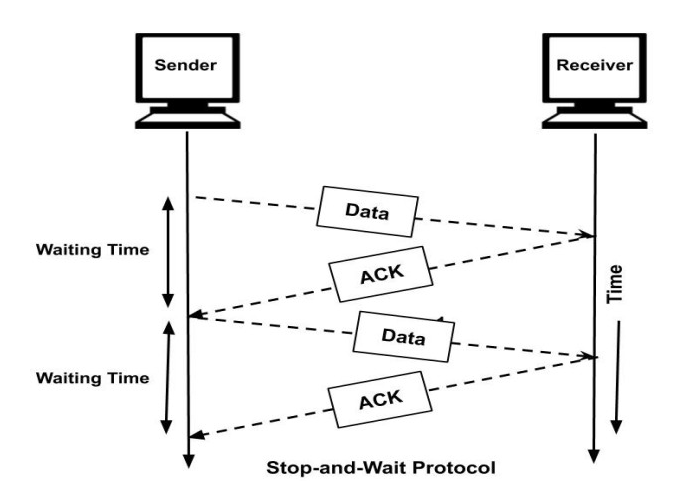
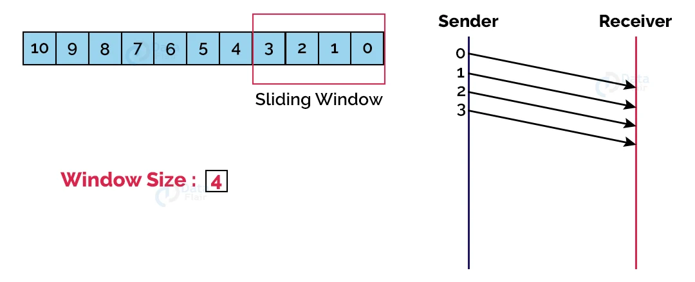
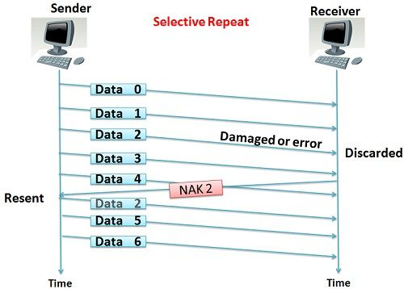
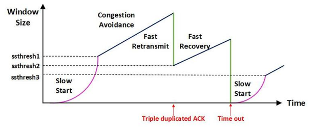

TCP는 UDP와 달리 신뢰성을 제공하기 위해 송신 속도를 제어하는데, 이 제어는 두 가지 층위에서 이루어진다:
- 흐름 제어 (Flow Control): 송신자와 수신자 간의 속도 조절
- 혼잡 제어 (Congestion Control): 네트워크 혼잡 상황에서의 속도 조절

## 흐름 제어 (Flow Control)

초창기 네트워크에서 데이터를 보낼 때 가장 큰 문제는 데이터를 보내는 속도와 처리하는 속도가 다르다는 것이다. 
수신자의 메모리 버퍼가 한정되어 있는 상황에서, 송신자가 데이터를 너무 많이 보내면 수신자는 이를 다 처리하지 못하고 패킷을 버리게 된다.(overflow) 
그 결과로, 수신자가 받을 수 있는 데이터 양을 할당하는 윈도우(Window)라는 개념이 도입되었다.

### Stop and Wait

패킷을 하나 보내고, 수신 측으로부터 확인 응답(ACK)이 올 때가지 기다린 후 다음 패킷을 보낸다. 
하나씩만 처리하기 때문에 네트워크 효율성이 매우 떨어진다.

### Sliding Window

수신 측에서 설정한 윈도우 크기(Window Size) 만큼의 패킷을 ACK 없이도 연속적으로 데이터를 보낼 수 있도록 하여 효율을 높인 방식이다. 
송신 측은 ACK를 받을 때마다 윈도우를 오른쪽으로 한 칸씩 이동(Slide)시키며 다음 데이터를 전송한다.

### 재전송 전략

#### Go-Back-N

슬라이딩 윈도우 방식 중 하나로, 에러가 발생한 지점부터 그 이후에 보낸 모든 패킷을 다시 재전송한다. 
수신 측은 순서가 맞지 않는 패킷이 오면 버리기 때문에 구현이 단순하지만, 성공적으로 전송된 패킷까지 재전송해야 하는 낭비가 있다.

#### Selective Repeat

에러가 발생한 특정 패킷만 선택적으로 재전송한다. 
수신 측은 순서가 맞지 않더라도 일단 받은 패킷을 버퍼에 보관해야 하므로 GBN보다 구현이 복잡하지만 효율적이다.

#### Selective Repeat의 구현이 더 복잡한 이유

GBN에서는 수신 측이 순서에 맞지 않는 패킷을 받으면 무조건 버리기 때문에, 단순히 마지막으로 연속적으로 받은 패킷의 시퀀스 번호만 추적하면 된다. 
반면에, Selective Repeat에서는 수신 측이 순서에 상관없이 도착한 패킷을 버퍼에 저장해야 한다. 
TCP의 특성상 패킷의 순서를 보장해줘야 하기 때문에 Selective Repeat에서는 나중에 유실된 패킷이 도착하면 
버퍼에 미리 쌓아둔 뒤쪽 패킷과 합쳐서 순서를 맞춰서 한꺼번에 상위 계층으로 올려보내야 한다.

## 혼잡 제어 (Congestion Control)

송신자와 수신자 둘 다 성능이 좋더라도, 그 사이를 연결하는 네트워크 장비(라우터, 스위치 등)의 한계가 있기 때문에 흐름제어만으로는 충분하지 않다. 
혼잡 제어는 송신 측과 수신 측 사이의 네트워크 통로(라우터 등)가 혼잡할 때, 데이터 전송 속도를 조절하여 네트워크 붕괴를 막는 기법이다.

### AIMD (Additive Increase / Multiplicative Decrease)

패킷 전송에 성공하면 윈도우 크기를 1씩 늘리며(Additive Increase), 
패킷 전송에 실패(혼잡 발생)하면 윈도우 크기를 절반으로 줄인다.(Multiplicative Decrease) 

AIMD의 가장 큰 목적 중 하나는 `늦게 들어온 사용자라도 대역폭을 나누어 가질 수 있게 하는 것`이다. 
만약 감소를 느리게 한다면, 이미 대역폭을 잡고 있는 기존 사용자가 자원을 계속 독점하게 된다.

여러 사용자가 네트워크를 공유할 때 공평하게 대역폭을 나누어 가질 수 있지만, 초기에 높은 대역폭을 확보하는 데 시간이 오래 걸린다.

### Slow Start

AIMD 방식이 1씩 천천히 증가하기 때문에 초기 전송 속도가 너무 느리다는 단점을 보완하기 위해 등장했다. 
Slow Start는 1부터 시작하지만, 성공할 때마다 윈도우 크기를 2배씩 늘린다. 
 
무한정 2배씩 늘리다보면 네트워크 혼잡이 발생할 수 있는데 이를 제어하기 위해 임계치(Slow Start Threshold)라는 개념을 사용한다:
- 임계치 이전: Slow Start로 2배씩 빠르게 증가
- 임계치 도달: AIMD 방식으로 전환하여 1씩 천천히 증가. 이 단계를 혼잡 회피(Congestion Avoidance)라고도 부른다.

만약, 데이터를 보내다가 패킷이 유실되면 네트워크가 혼잡하다고 판단하면 다음과 같은 조치를 취한다:
- 임계치 설정: 현재 윈도우 크기의 절반을 새로운 임계치로 저장한다.
- 윈도우 초기화: 윈도우 크기를 다시 1로 떨어뜨린다.
- 재시작: 다시 Slow Start부터 시작하여 새로운 임계치까지만 빠르게 올라간다.

### Fast Retransmission

초기 TCP에서는 패킷 유실을 감지하는 유일한 수단이 타임아웃(Timeout)뿐이었다. 
하지만 타임아웃은 네트워크의 왕복 시간(RTT)보다 여유롭게 설정되기 때문에, 패킷이 유실된 시점부터 재전송을 시작할 때까지 송신자는 아무것도 하지 않고 기다려야했다. 
이를 개선하기 위해 도입된 기법이 바로 Fast Retransmission이다. 

네트워크가 완전히 마비된 것이 아닌 단순히 패킷 하나가 중간에 유실된 상황이라면, 수신자는 유실된 패킷 이후에 들어오는 패킷들을 받으며 유실된 패킷에 대한 ACK를 계속 보낼 것이다. 
따라서, 만약 송신 측이 3개의 중복된 ACK(3 Duplicate ACKs)를 받으면, 타임아웃이 발생하기 전이라도 네트워크 혼잡의 신호로 간주하고 즉시 해당 패킷을 재전송한다. 

### Fast Recovery

초기 TCP 모델(Tahoe)에서는 3-ACKs로 유실을 감지하든, 타임아웃으로 유실을 감지하든 무조건 윈도우 크기를 1로 초기화하고 다시 Slow Start로 시작하였다. 

하지만 네트워크가 살아있음에도 Slow Start로 다시 시작한다면 비효율적일 수 있다. 
따라서, Fast Recovery 기법에서는 3-ACKs로 유실을 감지했을 때는 윈도우 크기를 절반으로 줄이고, 그 상태에서부터 AIMD 방식으로 천천히 증가시키도록 하였다. 