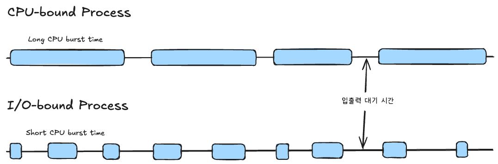
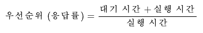
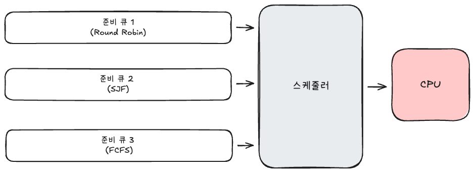
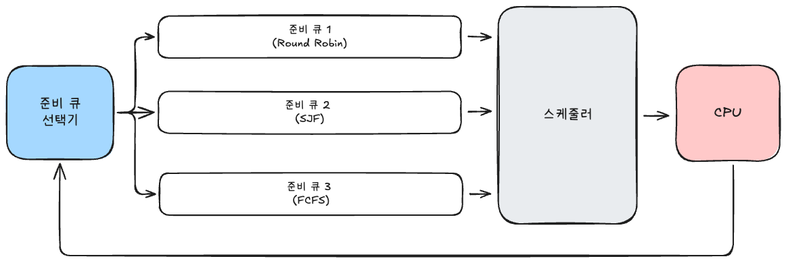

### 1. 스케줄링의 목적

CPU 스케줄링의 목표는 시스템의 자원을 효율적으로 관리하여 성능을 극대화하는 것이다. 
주요 목표는 다음과 같다:
- CPU 이용률 극대화: CPU가 쉬지 않고 최대한 일하게 한다.
- 처리량(Throughput) 향상: 단위 시간당 완료되는 프로세스 수를 늘린다.
- 응답 시간(Response Time) 최소화: 사용자 요청에 대한 응답 시간을 줄인다.
- 대기 시간(Waiting Time) 최소화: 프로세스가 준비 큐에서 기다리는 시간을 줄인다.
- 공정성: 모든 프로세스가 특정 자원에 소외되지 않고 공평하게 실행되도록 한다.

### 2. 프로세스의 우선순위

모든 프로세스가 동일한 우선순위를 갖지는 않는다. 운영체제는 프로세스의 특성에 따라 우선순위를 부여한다. 
- I/O bound process: 입출력 작업이 많아 CPU burst time이 짧은 프로세스로, 일반적으로 높은 우선순위를 갖는다.
- CPU bound process: 계산 작업이 많아 CPU burst time이 긴 프로세스로, 일반적으로 낮은 우선순위를 갖는다.

I/O bound process는 입출력 대기 시간에 머무르는 시간이 많은 반면, CPU bound process는 CPU 실행 시간에 머무르는 시간이 많다. 
두 프로세스가 동시에 자원을 요구한다면, I/O bound process가 더 높은 우선순위를 받아 먼저 실행되는 것이 시스템 전체 성능에 유리하다.

그 이유는 다음과 같다:
1. CPU 활용도 향상: I/O bound process가 먼저 실행되면, CPU가 짧은 시간 동안 작업을 수행한 후 빠르게 I/O 작업으로 전환할 수 있다. 그동안 CPU가 다른 프로세스를 처리할 수 있어 CPU 활용도가 높아진다.
2. 응답 시간 단축: I/O bound process는 일반적으로 사용자와의 상호작용(예: 키보드 입력, 마우스 클릭 등)을 처리하므로, 이들이 빠르게 응답하면 사용자 경험이 향상된다.
3. 기아 현상 방지: 만약 CPU bound process가 높은 우선순위를 갖는다면, 긴 실행 시간 동안 CPU를 독점하여 I/O bound process가 기아 상태에 빠질 수 있다. 이는 시스템의 공정성을 해치고 전체 성능을 저하시킬 수 있다.

### 3. 비선점형 스케줄링과 선점형 스케줄링

| 방식 | 선점형 스케줄링 | 비선점형 스케줄링 |
| --- | --- | --- |
| 특징 | 운영체제가 프로세스로부터 CPU 자원을 강제로 빼앗아 다른 프로세스에 할당할 수 있는 스케줄링 | 프로세스가 스스로 종료되거나 대기 상태에 접어들기 전까지 다른 프로세스가 끼어들 수 없는 스케줄링 방식 |
| 장점 | 한 프로세스의 독점을 막고 여러 프로세스에 골고루 CPU 자원을 배분 | 문맥 교환 횟수가 상대적으로 적어 오버헤드 발생이 적음 |
| 단점 | 문맥 교환 과정에서 오버헤드 발생 | 이미 어떤 프로세스가 CPU를 사용 중이라면 무작정 기다릴 수 밖에 없음 |

### 4. 비선점형 스케줄링의 종류

### 4-1. 선입 선처리 스케줄링 (FCFS, First Come First Served)

준비 큐에 도착한 순서대로 CPU를 할당하는 방식이다. 
하지만 실행 시간이 매우 긴 프로세스가 먼저 오면, 뒤에 있는 짧은 프로세스들의 대기 시간이 길어지는 `호위 효과(Convoy Effect)`가 발생할 수 있다.

### 4-2. 최단 작업 우선 스케줄링 (SJF, Shortest Job First)

실행 시간이 가장 짧은 프로세스에게 CPU를 할당하는 방식이다. 
평균 대기 시간을 최소화할 수 있지만, 실제로 각 프로세스의 실행 시간을 미리 알기 어렵고, 긴 작업이 계속 뒤로 밀려 기아 현상이 발생할 수 있다.

### 4-3. HRRN 스케줄링 (Highest Response Ratio Next)

최단 작업 우선 스케줄링의 기아 현상을 완화하기 위해 고안된 방식이다. 
SJF 스케줄링에 에이징 (aging) 개념을 적용한 기법으로, 대기 시간이 길어진 프로세스의 우선순위를 점차 높여준다. 
단순히 대기 시간이 긴 프로세스가 아닌 응답 비율(response ratio)을 높은 순서대로 CPU를 할당한다

해당 공식은 응답률에 대한 공식으로 프로세스의 실행 시간에 대비하여 얼마나 오래 기다렸는지를 표현한다.

### 5. 선점형 스케줄링의 종류

#### 5-1. 라운드 로빈 스케줄링 (RR, Round Robin)

FCFS 방식에 타임 슬라이스(Time Slice) 개념을 도입한 방식이다. 
각 프로세스는 정해진 시간만큼만 CPU를 할당받고 시간이 다 되면 작업을 마치지 않았더라도, 강제로 CPU를 반납하고 준비 큐의 맨 뒤로 이동한다. 
만약 할당 시간을 너무 길게 잡으면 FCFS와 다를 바 없고, 너무 짧게 잡으면 문맥 교환 오버헤드가 커지므로 적절한 타임 슬라이스 설정이 중요하다.

#### 5-2. 최소 잔여 시간 우선 스케줄링 (SRTF, Shortest Remaining Time First)

SJF 스케줄링의 선점형 스케줄링 버전이다. 
전체 실행 시간이 아닌, 남은 실행 시간이 가장 짧은 프로세스에게 CPU를 할당한다. 
따라서 새로운 프로세스가 도착했을 때, 현재 실행 중인 프로세스의 남은 시간보다 새로운 프로세스의 실행 시간이 짧은 경우 즉시 선점하여 CPU를 할당한다.

#### 5-3. 다단계 큐 스케줄링 (Multilevel Queue Scheduling)

준비 큐를 여러 개로 나누어 각각의 큐에 고정된 우선순위를 부여하는 방식이다. 
각각의 준비 큐에 대해 서로 다른 스케줄링 알고리즘을 적용할 수 있으며, 높은 우선순위 큐에 있는 프로세스가 모두 실행될 때까지 낮은 우선순위 큐의 프로세스의 실행되지 않는다. 
한번 배정된 큐를 벗어나지 못하기 때문에, 낮은 우선순위 큐의 프로세스들이 자원을 할당받지 못하는 기아 현상이 발생할 수 있다.

#### 5-4. 다단계 피드백 큐 스케줄링 (Multilevel Feedback Queue Scheduling)

다단계 큐 스케줄링의 단점인 기아 현상을 보완하기 위해 유연성을 높인 방식이다. 
CPU를 너무 오래 사용하는 프로세스는 낮은 우선순위 큐로 이동시키고, 너무 오래 기다린 프로세스는 높은 우선순위 큐로 이동(Aging)시키며, 프로세스가 큐 사이를 이동할 수 있도록 한다. 
다양한 상황에 유연하게 대응할 수 있지만, 다단계 큐 스케줄링보다 관리 비용도 높고, 큐 이동 기준을 설정하는 것이 어렵다는 단점이 있다. 