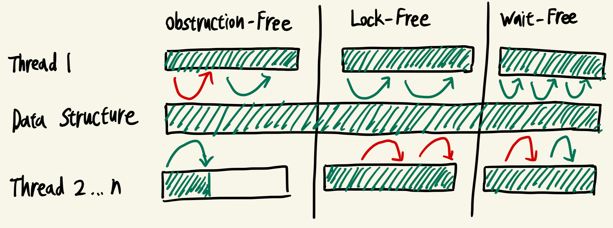
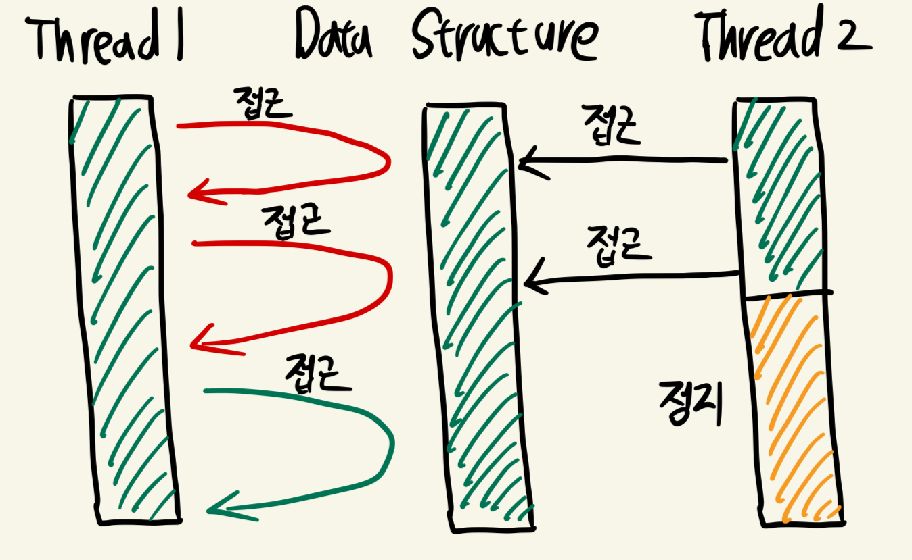
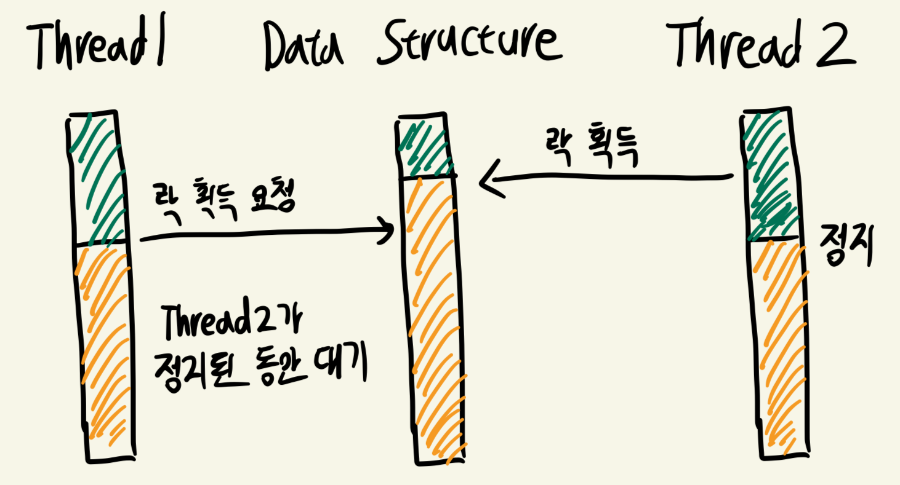
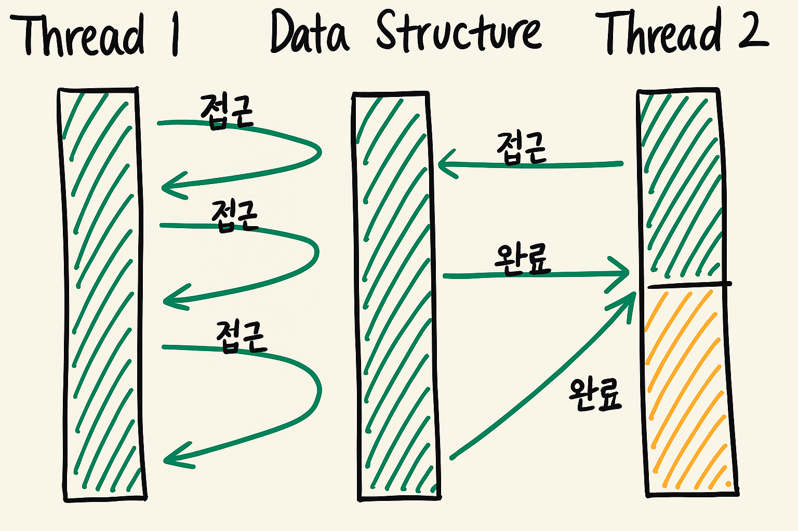
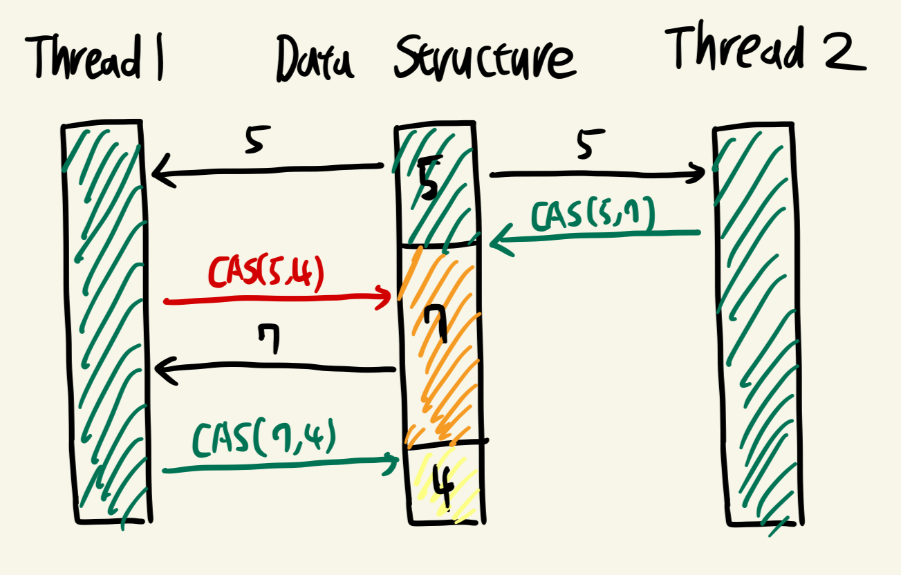
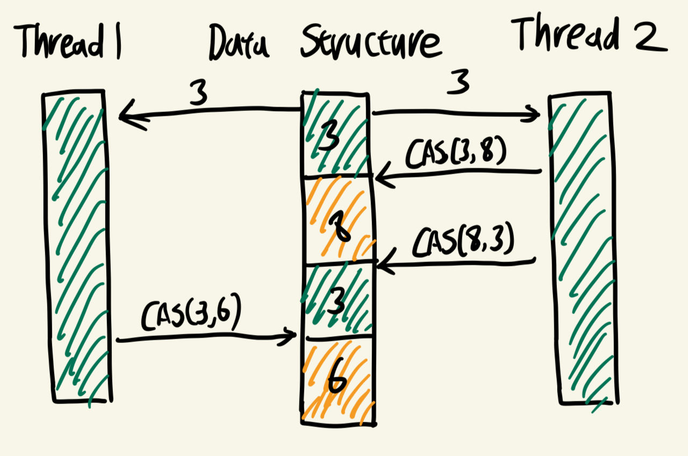

## Non-Blocking 알고리즘

### 배경
- 멀티스레드 환경에서 공유 자원 접근 시 락(Mutex/Semaphore) 사용은 직관적이지만 교착상태, 우선순위 역전, 문맥 전환 비용 문제가 발생할 수 있음
- Non-Blocking은 락 없이 동시성을 보장하며, CPU 제공 원자적 연산(Atomic Instruction)을 기반으로 동작

### 동작 원리

- 원자적 연산: CPU가 한 명령어 사이클에서 비교·교체 작업을 완료 -> 다른 스레드 개입 불가
- 재시도(Spin): 실패하면 루프 돌며 다시 시도



> 초록색 화살표: 요청 후 진행<br>
> 빨간색 화살표: 요청했으나 자원을 확보하지 못한 기아 상태

- 진행 보장 수준에 따라:
  - Obstruction-Free -> 충돌 없을 때만 진행 보장
    - Thread 1이 자원을 사용하는 동안 Thread 2..n은 대기
    - Thread 2..n이 자원을 사용하기 시작하면 Thread 1은 멈춤
    - 즉, 다른 스레드들이 중단된 상태라면 Thread 1은 계속 진행할 수 있지만, 충돌이 시 모두 멈출 수 있음
  - Lock-Free -> 최소 한 스레드 진행 보장
    - Thread 1이 진행되는 동안 Thread 2..n은 무한 재시도 가능
    - Thread 1의 작업이 끝나면 Thread 2..n 중 적어도 하나는 반드시 진행
    - 다만, 특정 스레드가 계속 자원 점유에 실패해 기아 상태에 빠질 가능성 존재
  - Wait-Free -> 모든 스레드 진행 보장
    - 각 스레드가 자신의 작업을 공개하고, 다른 스레드가 대신 수행(Helping)
    - Thread 1이 바쁘더라도 Thread 2..n의 작업이 다른 스레드에 의해 완료되므로 **기아 상태 없이** 유한 시간 내 실행이 보장

## Lock-Based vs Lock-Free

### Lock-based 방식



- 스레드가 공유 자원 접근 전 락 획득 -> 락 해제 전까지 다른 스레드는 대기
- 대표 예: Mutex, Semaphore
- 문제점: 락을 오래 잡으면 나머지 스레드는 진행 불가. 교착상태 발생 가능

### Lock-Free 방식



- 락 없이, CAS 같은 원자 연산으로 상태를 갱신
- CAS 실패 시 재시도, 성공한 스레드는 진행 지속
- 장점: 교착 상태 없음, 높은 동시성
- 단점: 재시도 비용, ABA 문제 발생 가능

## Wait-Free 알고리즘

### 배경
- Lock-Free도 여전히 특정 스레드가 무한 재시도로 진행 못할 가능성 존재
- Wait-Free는 모든 스레드가 유한 시간 안에 반드시 완료를 보장 -> 실시간 시스템에서 중요



### 동작 원리
- 각 스레드가 자신의 작업을 전역 배열/큐에 기록
- 다른 스레드들이 그 작업을 대신 도와줌(Helping)
- 모든 요청이 처리되므로 기아 상태 없음

## CAS (Compare-And-Swap / Compare-And-Set)

Lock-Free와 Wait-Free를 구현하는 핵심 기술

### 배경
- 락 없이도 데이터 무결성을 보장하려면 조건부 교체가 필요
- CAS는 메모리 주소의 값이 예상값과 같으면 새 값으로 교체를 원자적으로 수행

### 동작 원리

```java
boolean CAS(addr, expected, newValue) {
    if (*addr == expected) {
        *addr = newValue;
        return true;    
    }
    return false;
}
```



- CPU가 비교와 교체를 한 번에 수행 -> 중간 개입 불가
- 예상 값이 일치하면 교체, 불일치하면 실패 후 재시도
- 그림을 예시로 들면 CAS(5, 7), CAS(7, 4)는 예상값과 같아 교체가 되었지만, CAS(5, 4)는 예상값과 달라 실패
- Spin Loop로 실패 시 재시도

## ABA 문제

### 배경
- CAS는 값이 같다만 체크하므로, 같이 A -> B -> A로 변경된 경우를 인식하지 못함
- Lock-Free 자료구조에서 이로 인해 잘못된 상태로 진행될 위험이 있음

### 예시



1. X를 읽어 3임을 기억해 둠
2. 먼저 실행되어 CAS(3, 8) 수행 -> 성공 -> X = 8
3. 이어서 CAS(8, 3) 수행 -> 성공 -> X = 3
4. 이제 CAS(3, 6) 수행 -> 예상값 3이 맞으므로 성공 -> X = 6
5. 하지만 실제로는 X가 8에서 3으로 변경된 후 다시 3에서 6으로 변경된 상태
6. 문제의 핵심: 값이 같아도 의미적으로 완전히 다른 상태일 수 있음