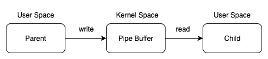
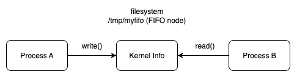
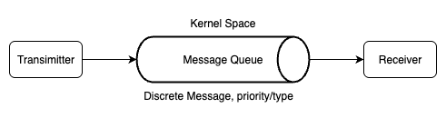
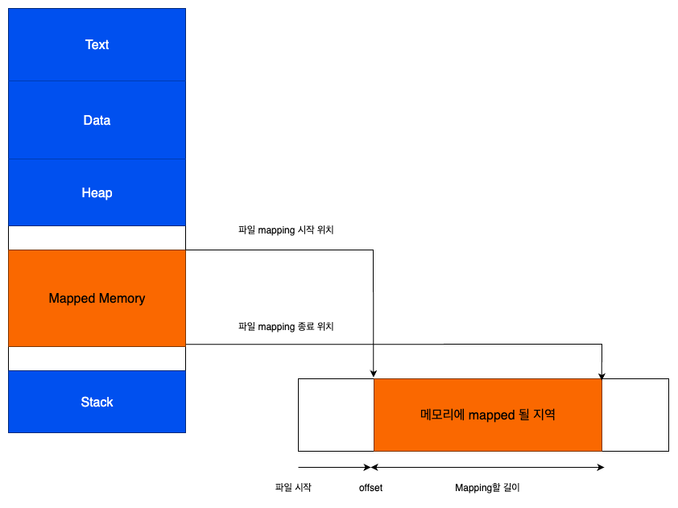
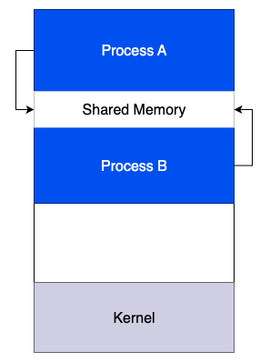
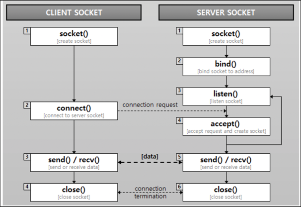
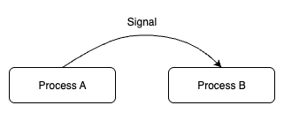

## IPC(Inter-Process Communication, 프로세스 간 통신)
- 운영체제에서 실행되는 프로세스는 각각 독립적인 주소 공간(메모리)를 가지며 한 프로세스의 메모리에 다른 프로세스가 직접 접근하는 것은 보안상, 안정성상 금지되어 있다
- 따라서, 여러 프로세스가 데이터를 주고받거나 협력하기 위해서는 운영체제가 제공하는 IPC 메커니즘을 사용해야 한다

## 주요 IPC 메커니즘 종류 및 특성

### 익명 파이프 (Anonymous Pipe)

- 부모-자식 등 연관 관계가 있는 프로세스 사이에 만드는 단방향 바이트 스트림. 커널이 관리하는 순서 있는 버퍼를 통해 통신
- 커널 파이프 버퍼에 쓰면 반대쪽이 읽음
- 바이트 스트림이라 메시지 경계가 없음 ("몇 바이트가 한 덩어리" 라는 개념이 없음)
- 동작 흐름
  - 하나의 파이프를 만들고, fork()로 부모와 자식을 나눈 뒤 부모는 쓰기 끝으로 데이터를 보내고 자식은 읽기 끝으로 데이터를 받음
- 특징
  - 순서 보장 : 데이터를 쓴 순서 그대로 반대쪽에서 읽힘. 즉, 중간에서 순서가 뒤집히거나 섞이지 않음
  - 단방향·로컬 전용 : 한 파이프는 읽기 전용 끝과 쓰기 전용 끝을 가짐. 따라서, 한쪽에서는 쓰기만, 다른 쪽에서는 읽기만 가능. 또한 파이프는 운영체제 커널 안에서만 관리되므로 같은 컴퓨터 내부에서만 사용.
  - blocking /non-blocking I/O 지원 : 읽을 데이터가 없을 때 read()가 기다리도록(blocking) 하거나, 곧바로 반환(non-blocking)하도록 설정할 수 있음
  - EOF 감지 : 쓰기 끝을 가진 모든 프로세스가 닫으면, 읽는 쪽에서 read() 호출 시 0을 반환하여 데이터가 더 없음을 알림
- 용도
  - 쉘 파이프파인 (ls | grep) 같은 짧고 직렬적인 처리

### 이름 있는 파이프 (Named Pipe, FIFO)

- 파일 시스템에 이름으로 존재하는 파이프. 연관 관계가 없는 독립 프로세스끼리도 사용 가능
- mkfifo()로 특수 파일 생성 만들고, open()으로 읽기/쓰기
- 여전히 바이트 스트림(메시지 경계 없음)
- 동작 흐름
  - 파일시스템에 FIFO 노드를 만들고, 프로세스 A는 쓰기 전용으로 열어 데이터를 넣고, 프로세스 B는 읽기 전용으로 열어 데이터를 꺼냄
- 특징
  - 파일 시스템 노드 기반 : FIFO는 파일 시스템에 특별한 파일로 생성되기 때문에, 서로 관련 없는 프로세스들도 같은 경로(/tmp/myfifo 등)를 열어 통신 가능
  - 권한 제어 가능 : 일반 파일처럼 소유자, 권한을 통해 접근 제한 가능
  - 반이중 통신 : 한 FIFO는 한 방향으로 데이터를 흐르게 하기 때문에, 양방향 통신을 하려면 FIFO를 두 개 만들어야 함
- 용도
  - 간단한 로컬 명령/로그 파이프, 가벼운 데몬 제어

### 메시지 큐 (Message Queue)

- 커널이 관리하는 메시지 단위 큐. 송신자/수신자가 느슨하게 결합
- 메시지 경계 보존, 우선순위/타입 필드 가능
- 동작 흐름
  - 송신 프로세스와 메시지를 큐에 넣으면, 수신 프로세스가 큐에서 메시지를 하나씩 꺼내 읽음
  - (메시지는 경계 단위로 구분되며, 우선순위나 타입에 따라 원하는 메시지만 골라 받을 수 있음)
- 특성
  - 메시지 경계 보존 : 파이프와 달리 데이터가 "메시지 단위"로 구분되어, 보낸 메시지는 읽을 때도 동일한 단위로 전달
  - 선택적 수신 : 메시지에 타입이나 우선순위를 지정하여, 특정한 메시지를 골라받을 수 있음
  - 비동기 통신 : 송신자와 수신자가 동시에 실행할 필요가 업음. 송신자는 메시지를 큐에 넣고 바로 다른 일을 하고, 수신자는 나중에 메시지를 꺼내면 됨
  - 크기 제한 : 메시지의 최대 크기와 큐에 동시에 쌓일 수 있는 메시지 수에는 운영체제에 정해진 제한이 존재
- 용도
  - 요청/응답, 작업 큐, Multi Reader/Writer 구조에서 느슨한 결합

### 메모리 맵 (Memory Map)

- 파일(또는 디바이스)을 프로세스 주소공간에 매핑해 메모리 접근으로 파일 I/O 수행
- 페이지 단위 지연 로딩(page fault), 페이지 캐시 활용
- 동작 흐름
  - 여러 프로세스가 같은 파일을 자기 메모리 공간에 매핑하고, 파일처럼 읽고 쓰되 메모리 접근처럼 다룬다.
  - 수정된 내용은 페이지 캐시를 통해 파일에 반영된다. (MAP_SHARED인 경우)
- 특성
  - 메모리처럼 다루는 파일 I/O : 파일을 디스크에서 읽지 않고, 메모리에 매핑하여 곧바로 배열처럼 접근 가능
  - 페이지 단위 관리 : 실제로는 페이지 단위로 불러오고(page fault 발생 시), 필요없는 페이지는 다시 내보냄
  - 공유 방식 선택 가능 : MAP_SHARED 매핑 시 변경 사항이 파일에 반영되고 다른 프로세스에도 보이지만, MAP_PRIVATE로 매핑하면 각자 사본을 가져서 다른 프로세스나 원본에 영향을 주지 않음
  - 동기화 필요 : 여러 프로세스가 같은 파일을 매핑해 공유할 때는 동시에 접근해 데이터가 꼬이지 않도록 동기화 필요
- 용도
  - 대용량 파일 조회/가공, DB/검색 엔진 인덱스, 파일 기반 로컬 IPC

### 공유 메모리 (Shared Memory)

- 커널이 제공하는 이름/핸들 기반 공유 영역을 여러 프로세스 주소공간에 동일 물리페이지로 매핑
- 가장 빠른 IPC(copy 없음, 곧바로 같은 메모리)
- 동작 흐름
  - 여러 프로세스가 같은 물리 메모리 영역을 공유하여, 한쪽이 데이터를 쓰면 다른 쪽이 곧바로 그 내용을 확인함
  - 경합을 막기 위해 세마포어/뮤텍스 같은 동기화 메커니즘과 함께 사용
- 특성
  - 가장 빠른 IPC : 데이터를 커널 버퍼에 거쳐 복사하지 않고, 동일한 물리 메모리 영역을 그대로 참조하기 때문에 오버헤드가 거의 없음
  - 즉시 반영 : 한 프로세스가 값을 변경하면 다른 프로세스가 같은 영역을 읽을 때 바로 확인 가능
  - 동기화 필요 : 동시에 읽고 쓰면 데이터가 꼬일 수 있으므로, 세마포어나 뮤텍스를 반드시 함께 사용
  - 익명 공유 가능 : /dev/shm 같은 tmpfs나 memfd_create()로 파일 없이도 공유 메모리를 만들 수 있음
- 용도
  - 실시간/고주파 데이터(프레임/센서/로그 버퍼). 초저지연 통신

### 소켓 (Socket)

- 프로토콜(TCP/UDP/UNIX) 위의 범용 통신 엔드포이트. 로컬/원격 모두 지원
- TCP(스트림) : 순서·신뢰 보장, 바이트 스트림
- UDP(데이터그램) : 경계 보존, 손실 가능, 비연결
- UNIX 도메인 : 로컬용 고속/권한 제어, 파일디스크립터 전달(SCM_RIGHTS) 등
- 동작 흐름
  - 서버와 클라이언트가 각각 소켓을 만들고 연결한 뒤, 서버는 accept로 연결을 받아들이고 클라이언트는 connect로 접속
  - 연결이 맺어지면 양쪽이 send/recv로 데이터를 주고받음
- 특성
  - 네트워크 표준 IPC : 같은 컴퓨터 안에서도 네트워크를 통해 다른 컴퓨터와도 동일한 방식으로 통신 가능
  - 통신 방식 다양 : TCP는 연결 지향으로 신뢰성·순서를 보장하지만 바이트 스트림 형태이고, UDP는 연결less이며 빠르지만 손실될 수 있음
  - 이벤트 주도 I/O : 언제 데이터가 올지 모르기 때문에, select, poll, epoll 같은 메커니즘으로 여러 소케을 감시하며 이벤트 기반으로 처리
  - 성능 튜닝 요소 : TCP는 흐름 제어, Nagle 알고리즘(작은 패킷 묶음 전송), Delayed ACK 같은 기능을 제공
- 용도
  - 클라이언트-서버/분산 시스템, 마이크로서비스, 로컬 데몬 IPC(UNIX)

### 세마포어 (Semaphore), 뮤텍스 (Mutex)

- 데이터 전달이 아니라 동기화(상호배제/자원 수 제한) 수단
- 뮤텍스 : "1명만 들어와라" (소유 개념 존재)
- 세마포어 : "N명까지 들어와라" (카운팅, 소유 없음)
- 동작 흐름
  - 여러 프로세스가 공유 자원에 들어가기 전에 잠금을 걸고, 다 쓴 뒤에는 잠금을 풀어줌
  - 뮤텍스는 한 번에 하나만, 세마포어는 정해진 개수만큼 동시에 허용
- 특성
  - 데이터 무결성 보장 : 여러 프로세스가 공유 자원에 동시에 접근하지 않도록 차례대로 접근하게 만듦
  - 뮤텍스 : 오직 한 프로세스만 자원을 사용할 수 있도록 보장. 락을 건 프로세스만 해결 가능
  - 세마포어 : 허용 가능한 개수(N)를 정해두고, 여러 프로세스가 동시에 자원을 접근할 수 있도록 제어.
- 용도
  - 공유 메모리/메모리맵 위 데이터 구조 보호, 생산자-소비자, 풀 관리

### 신호 (Signals)

- 커널/프로세스가 비동기 이벤트를 특정 프로세스(혹은 스레드)에서 통지
- 표준 신호(큐잉 X, 기본동작 있음) vs 실시간 신호(큐잉 O, 부가 데이터 가능)
- 핸들러는 async-signal-safe 함수만 호출해야 함
- 동작 흐름
  - 커널이나 다른 프로세스가 특정 이벤트를 알리기 위해 신호를 보내면, 대상 프로세스는 기본 동작을 수행하거나 등록된 핸들러 함수로 처리
  - 예: SIGINT -> 기본은 종료, 핸들러를 두면 종료 대신 다른 동작
- 특성
  - 비동기 알림 : 프로세스에 특정 이벤트가 발생했음을 즉시 알림. 예를 들어 SIGINT는 Ctrl+C 입력 시 발생
  - 기본 동작 vs 사용자 정의 동작 : 각 신호마다 기본 동작(종료, 무시 등)이 있으며. 
- 용도
  - 타이머/자식 종료 통지, 간단한 인터럽트