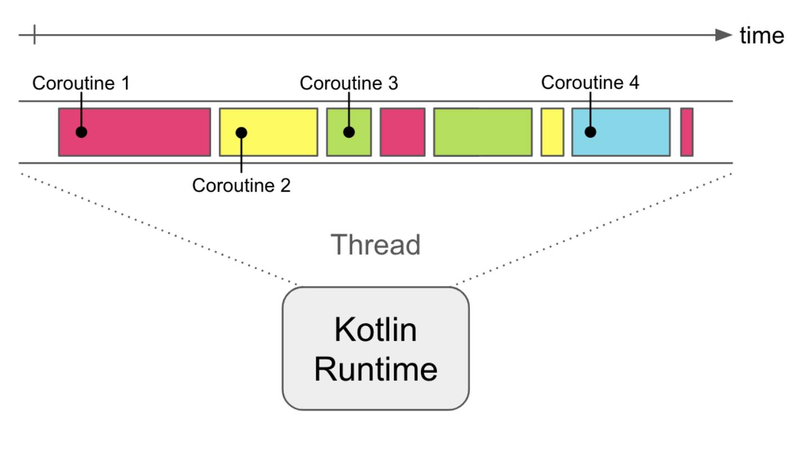

### 1. 프로세스(Process)란?

> 컴퓨터에서 연속적으로 실행되고 있는 프로그램

- 즉, 프로세스는 메모리에 로드되어 CPU가 실행 중인 프로그램 단위
- 각 프로세스는 독립된 메모리 공간(코드, 데이터, 힙, 스택)을 가짐
    - 코드
      - 실행할 프로그램의 기계어(명령어)가 저장된 영역
      - 컴파일된 결과(.text)
    - 데이터
      - 프로그램 시작 시 메모리에 할당되고, 종료 시까지 유지되는 데이터
      - 전역 변수(global), static 변수(static)가 여기에 속함
    - 스택
      - 함수 호출 시 생기는 지역 변수, 매개변수, 반환주소 등이 저장되는 영역
    - 힙
      - 실행 중에 동적으로 할당되는 메모리(런타임 시점)

### 2. 스레드(Thread)란?

> 어떠한 프로그램 내에서, 특히 프로세스 내에서 실행되는 흐름의 단위

- 하나의 프로세스는 여러 스레드를 가질 수 있음
- 스레드들은 프로세스의 메모리를 공유함
  - Code / Data / Heap 영역은 공유하되
  - Stack은 스레드별로 따로 가짐

### 3. 여러 개의 프로세스를 쓰는 대신 여러 개의 스레드(Mutli-thread)를 쓰는 이유

1. 자원 공유의 용이성
   - 스레드는 동일한 메모리 공간을 공유하기 때문에 데이터 교환이 빠름
   - 프로세스 간에 데이터를 주고받으면 `IPC(Inter-Process Communication)` 메커니즘을 사용해야 하므로 오버헤드가 큼
2. Context Switching 비용 절감
   - 프로세스 간 전환은 메모리 맵, 페이지 테이블 등 Context를 교체해야 하므로 비용이 큼
   - 스레드 간 전환은 스택 포인터와 레지스터만 교체하면 되므로 훨씬 가벼움
3. 응답성과 메모리 효율성 향상
   - 하나의 작업(프로세스) 안에서 여러 일을 동시에 처리 가능
   - 프로세스를 여러 개 띄우는 것보다 메모리 사용량이 적음
4. 병렬 처리(멀티코어 활용) 가능
   - CPU 코어당 스레드를 하나씩 점유하여 병렬 처리하여 처리량(throughput)을 높일 수 있음

### 4. 코루틴(Coroutine)란?

> 코루틴은 루틴의 일종으로 `협동 루틴(Cooperative Routine)`을 의미. 이는 서로가 서로를 호출하며 비동기적인 작업을 효율적으로 처리

- 코루틴은 스레드와 달리, 운영체제(OS)가 관리하는 것이 아니라 프로그램 언어 수준에서 관리
- 코루틴은 스레드보다 훨씬 가벼운 실행 단위로, 비동기적으로 여러 작업을 처리하는 데 사용
- 코루틴은 `일시 중단(suspension)`과 `재개(resumption)`가 가능하여, 긴 작업을 수행하는 동안에도 다른 작업을 처리할 수 있음
    - Suspend(일시 중단): 코루틴은 중간에 일시적으로 중단될 수 있음. 이때 현재 스레드의 상태가 저장되고, 나중에 필요할 때 재개(Resume)됨
    - Resume(재개): 중단된 코루틴은 나중에 중단된 지점부터 실행될 수 있음. 이 과정은 다른 작업을 처리하는 동안 스레드를 차지하지 않으므로 효율적
    - 예를 들어, 코루틴 A, B가 있을 때, A가 일시 중단되면 B가 실행되고, B가 일시 중단되면 다시 A가 재개되는 식으로 협력적으로 실행됨

### 5. 병렬성 프로그래밍, 동시성 프로그래밍과의 연관성

- 병렬성(Parellism): 여러 작업이 실제로 동시에 실행되는 것
- 동시성(Concurrency): 여러 작업이 시간을 나누어 실행되는 것

#### 스레드가 병렬성을 지원하는 방식

- 멀티코어 CPU에서 여러 스레드가 동시에 실행되어 각기 다른 작업을 병렬로 처리
  - OS는 여러 CPU 코어를 사용하여 다양한 스레드를 동시에 실행. 각 스레드는 독립적으로 실행되어 병렬로 진행
- 멀티코어 시스템에서 두 개의 스레드가 동시에 실행되며 각각 다른 작업을 처리
  - 스레드 1: 네트워크 요청
  - 스레드 2: 데이터베이스 쿼리 실행
  - CPU는 두 스레드를 다른 코어에서 동시에 실행하여 병렬 처리

#### 스레드가 동시성을 지원하는 방식

- 하나의 CPU 코어에서 여러 스레드가 실행되지만, 실제로는 시간을 나누어 실행
  - CPU는 각 스레드에게 실행할 시간을 분배하고, 스케줄링을 통해 빠르게 작업을 전환하며 처리
  - 실제로 동시 실행을 아니지만, 사용자로 하여금 여러 작업이 동시에 실행되는 것처럼 느끼게 함
- 하나의 CPU 코어에서 두 개의 스레드가 실행되며, 각 스레드는 일정 시간 동안 실행되고, 그 후 다른 스레드로 전환
- 이 과정을 스케줄링이라고 하며, 실제로는 시간을 나누어 실행하는 방식

#### 코루틴이 동시성을 지원하는 방식

- 코루틴은 동시성(Concurrency)을 지원하는 경량화된 실행 흐름
  - 스레드처럼 OS가 직접 관리하는 실행 흐름이 아니며, 언어 수준에서 관리되기 때문에 훨씬 가볍고 빠름
  - 코루틴은 일시 중단(suspension)과 재개(resumption)를 통해, 하나의 스레드 내에서 여러 작업을 번갈아가며 처리
- 코루틴은 단일 스레드에서 여러 작업을 효율적으로 처리하는 비동기적인 방식 지원
  - 일시 중단(suspend)된 코루틴은 다른 코루틴을 실행하는 시간을 제공하여, 여러 작업을 처리하는 것처럼 보이게 함
  - 예를 들어, 네트워크 요청을 하는 코루틴이 일시 중단되면, 그 시간 동안 다른 코루틴이 실행될 수 있음.
  - 이는 하나의 스레드에서 동시에 여러 작업을 효율적으로 처리하는 방법

### 6. 프로세스 vs 스레드 vs 코루틴 비교

| 항목                         | 프로세스 (Process)                       | 스레드 (Thread)                                 | 코루틴 (Coroutine)                              |
|------------------------------|-----------------------------------------|----------------------------------------------|----------------------------------------------|
| 정의                         | 실행 중인 프로그램의 인스턴스          | 프로세스 내에서 실행되는 흐름의 단위                         | 사용자 수준에서 관리되는 실행 흐름                          |
| 메모리                       | 독립된 메모리 공간 (Code, Data, Heap, Stack) | 프로세스의 Code, Data, Heap 공유, Stack은 각 스레드별로 관리 | 스레드의 Code, Data, Heap, Stack 모두 공유           |
| 자원 공유                    | 프로세스 간 데이터 공유 어려움 (IPC 필요)  | 프로세스 내에서 데이터 공유 가능                           | 동일 스레드 내에서 실행되어 자원 공유 매우 용이                  |
| 컨텍스트 전환 비용           | 높음 (메모리 맵, 페이지 테이블 등 교체 필요) | 낮음 (스택 포인터와 레지스터만 교체)                        | 매우 낮음 (사용자 수준에서 관리됨)                         |
| 응답성                       | 상대적으로 느림 (전체 프로세스 전환 필요)  | 빠름 (동시에 여러 작업 가능)                            | 매우 빠름 (비동기적 실행으로 동시 작업 효율적 처리)               |
| 병렬성                       | 멀티 코어에서 병렬 처리 가능           | 멀티 코어에서 병렬 처리 가능                             | 단일 스레드 내에서 동시성(Concurrency) 구현, 병렬 처리 가능은 아님 |
| 생성 및 소멸 비용            | 크고 느림 (메모리 할당, 종료 등)        | 비교적 작고 빠름 (스레드 풀 활용)                         | 매우 작고 빠름 (메모리와 오버헤드 최소화)                     |
| 동기/비동기 처리             | 주로 동기적 (단일 작업 흐름)            | 동기적 및 비동기적 (멀티스레드 처리 가능)                     | 주로 비동기적 (비동기 처리를 위한 특화된 구조)                  |
| 사용 예시                    | 서버, 웹 애플리케이션, 멀티프로세싱 작업  | 멀티태스킹, GUI 애플리케이션, 웹서버                       | 네트워크 요청, 파일 입출력, UI 응답성 유지 등                 |