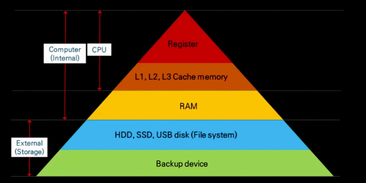

# CPU와 메모리 구조

## 목차
1. [용어 정리](#용어-정리)
   - [CPU (프로세서)](#cpu-프로세서)
   - [버스(Bus)](#버스-bus)
   - [MMU (Memory Management Unit)](#mmu-memory-management-unit)
   - [TLB (Translation Lookaside Buffer)](#tlb-translation-lookaside-buffer)
   - [페이지 (Page)](#페이지-page)
   - [MESI 프로토콜](#mesi-프로토콜)
2. [CPU 메모리 계층](#cpu-메모리-계층)
   - [레지스터 (Register)](#1-레지스터-register)
   - [캐시 (Cache: L1, L2, L3)](#2-캐시-cache-l1-l2-l3)
   - [메인 메모리 (RAM)](#3-메인-메모리-ram)
   - [보조 저장장치 (SSD, HDD)](#4-보조-저장장치-ssd-hdd)
3. [CPU 캐시 일관성 문제](#cpu-캐시-일관성-문제)
4. [실행 파일이 실행되는 과정](#실행-파일이-실행되는-과정)
5. [OS의 가상 메모리와 페이지 교체](#os의-가상-메모리와-페이지-교체)
   - [가상 메모리 (Virtual Memory)](#가상-메모리-virtual-memory)
   - [페이지 교체 (Page Replacement)](#페이지-교체-page-replacement)
6. [OS에서 메모리 관리](#os-에서-메모리-관리)

## 용어 정리

### CPU (프로세서)
CPU(Central Processing Unit)는 컴퓨터의 중앙 처리 장치로, 메모리에 저장된 명령어를 해석하고 실행함  
또한 제어 장치(CU)를 통해 메모리와 입출력 장치의 동작을 지시하여 시스템 전체가 올바르게 동작하도록 관리함

=> 즉, CPU는 "명령어를 해석하고 실행하며, 필요한 데이터를 메모리나 주변 장치와 주고받도록 지시하는 장치"임

CPU의 기본 구성 요소
- CPU는 크게 연산 장치, 제어 장치, 레지스터로 이루어져 있음으며, 내부 버스로 연결되어 빠르게 데이터를 주고받음

1. 연산 장치(ALU, Arithmetic Logic Unit)
- 실제 계산을 담당하는 장치
- 산술 연산(+, -)과 논리 연산(AND, OR, 비교 등)을 수행
2. 레지스터(Registers)
- CPU 내부의 작은 저장 공간
- 현재 실행할 명령어나 연산에 필요한 데이터를 잠시 보관
- 메모리보다 훨씬 빠르기 때문에 CPU가 즉시 접근 가능
3. 제어 장치(CU, Control Unit)
- 메모리에서 명령어를 읽고 해석함=
- ALU와 레지스터에 "무엇을 해야 하는지" 지시함
- 입출력 장치(I/O)와 메모리 사이의 데이터 흐름을 제어함

쉽게 비유하면
- 레지스터는 “메모장”: CPU가 지금 바로 쓸 데이터를 잠깐 적어두는 공간
- ALU는 “계산기”: 실제 계산을 수행하는 곳
- Control Unit은 “관리자”: 언제, 어떤 계산을 할지 지시하고 메모리/입출력 장치와 연결

즉, CPU는 관리자(CU)가 계산기(ALU)와 메모장(레지스터)을 이용해 명령어를 처리하는 구조라고 볼 수 있음

### 버스(Bus)  
버스는 하드웨어를 물리적으로 연결하여 서로 데이터를 주고받을 수 있게하는 통로 역할을 함   
이때 버스는 데이터 버스, 주소 버스, 제어 버스로 나뉨

1. 데이터 버스
- 프로세서와 메인 메모리, 주변 장치들 사이에서 데이터를 전송할 때 쓰임
- 이때 버스는 데이터를 주고받아야 하므로 양방향

2. 주소 버스
- 프로세서에서 메모리의 주소를 지정할 때, 그 주소가 어디인지에 대한 정보를 보내는 버스. 
- 즉, 프로세서에서 01110011이라는 위치에 데이터를 보내려면 데이터 뿐만 아니라 데이터의 목적지인 01110011도 버스를 통해 보내는데 이를 주소 버스를 통해 보냄.
- 결국 프로세서가 주소를 지정하면서 보내는 버스로 단순히 주소를 보내면 되니 단방향임

3. 제어 버스
- 프로세서가 메모리나 I/O에 제어 신호를 전송하거나 반대로 프로세서에 동작을 지시할 수 있음. 
- 그러므로 단방향일수도 양방향일수도 있음

### MMU (Memory Management Unit)
MMU는 CPU 내부에 있는 하드웨어 장치로, 가상 주소를 물리 주소로 변환하는 역할을 담당함
- 가상 메모리 시스템에서 핵심적인 역할을 수행
- CPU가 가상 주소에 접근할 때마다 MMU가 이를 물리 주소로 실시간 변환
- 페이지 테이블을 참조하여 가상 주소와 물리 주소 간의 매핑 정보를 관리
- 메모리 보호 기능도 제공하여 프로세스 간 메모리 격리 보장

### TLB (Translation Lookaside Buffer)
TLB는 MMU 내부에 있는 캐시로, 최근에 사용된 가상 주소 → 물리 주소 변환 정보를 저장함
- 주소 변환 속도를 높이기 위한 하드웨어 캐시
- TLB 히트 시 페이지 테이블 조회 없이 즉시 물리 주소 획득 가능
- TLB 미스 시 페이지 테이블을 조회하여 변환 정보를 TLB에 저장
- 일반적으로 64~512개의 엔트리를 가짐

### 페이지 (Page)
페이지는 가상 메모리 시스템에서 메모리를 관리하는 기본 단위임
- 보통 4KB 크기로 고정됨 (일부 시스템에서는 2MB, 1GB 등 다양한 크기 지원)
- 운영체제가 프로그램을 메모리에 적재할 때 페이지 단위로 관리
- 페이지 단위로 디스크와 메모리 간 데이터 교환이 이루어짐
- 페이지 폴트(Page Fault) 발생 시 디스크에서 해당 페이지를 메모리로 로드

### MESI 프로토콜
MESI는 멀티프로세서 환경에서 캐시 일관성을 유지하기 위한 프로토콜임
- **Modified(M)**: 캐시 라인이 수정되었고 메모리와 다른 상태
- **Exclusive(E)**: 캐시 라인이 메모리와 동일하고 다른 프로세서가 공유하지 않는 상태
- **Shared(S)**: 여러 프로세서가 같은 캐시 라인을 공유하는 상태
- **Invalid(I)**: 캐시 라인이 유효하지 않은 상태
- 하드웨어에서 자동으로 관리되며, 프로그래머가 직접 제어할 수 없음

## CPU 메모리 계층

CPU는 연산 속도에 비해 메모리 접근 속도가 매우 느림
이를 보완하기 위해 빠르지만 작은 저장소와 느리지만 큰 저장소를 계층적으로 구성함
이를 메모리 계층 구조라고 함

### 1. 레지스터 (Register)

* CPU 내부에 있는 가장 빠른 저장 장치
* 연산 시 직접 사용하는 값이 저장됨
* 용량은 수십\~수백 바이트 수준임

### 2. 캐시 (Cache: L1, L2, L3)

CPU는 연산 속도가 매우 빠르지만, 메인 메모리(RAM) 접근은 상대적으로 느림
현실적으로 모든 데이터를 레지스터에만 저장할 수는 없음 → 레지스터는 용량이 작고 제작 비용이 비싸기 때문임

따라서 서로 다른 속도와 용량을 가진 메모리를 계층적으로 배치해 시스템 성능을 높임
이때 메인 메모리와 CPU 속도 차이를 완충하기 위해 캐시 계층(Cache Hierarchy)이 존재함

#### 메인 메모리와의 관계

* 메인 메모리(RAM)는 실행 중인 프로그램의 코드와 데이터를 저장하는 공간임
* 주로 DRAM(Dynamic RAM)을 사용하며, 주기억장치(Primary Storage)라고 부름
* CPU는 RAM에 직접 접근하면 속도가 느리므로, 필요한 일부 데이터를 캐시에 저장해 빠르게 접근함

#### 캐시 계층 구조

1. L1 캐시 (Level 1 Cache)

    * CPU 코어 내부에 위치
    * 가장 빠른 캐시 (1\~3 사이클 수준)
    * 용량은 매우 작음 (32KB\~128KB)
    * 명령어 캐시와 데이터 캐시로 나뉨
    * CPU가 가장 먼저 찾는 저장소임

2. L2 캐시 (Level 2 Cache)

    * CPU 코어 내부 또는 바로 근처에 위치
    * L1보다 느리지만 더 큰 용량 (수백 KB\~수 MB)
    * 보통 각 코어마다 독립적으로 존재
    * L1에서 캐시 미스가 발생하면 L2에서 확인함

3. L3 캐시 (Level 3 Cache)

    * CPU 칩 내부에 존재하며 여러 코어가 공유함
    * L1, L2보다 느리지만 RAM보다는 빠름 (수 MB\~수십 MB)
    * 멀티코어 환경에서 코어 간 데이터 교환 및 일관성 유지에 사용됨
    * L1, L2에서 모두 실패하면 L3에서 확인하고, 그래도 없으면 RAM 접근

#### 캐시 동작 원리

* 캐시 히트(Cache Hit): CPU가 필요한 데이터가 캐시에 이미 있음 → 빠르게 접근 가능
* 캐시 미스(Cache Miss): 캐시에 데이터가 없음 → L1 → L2 → L3 순으로 탐색, 없으면 RAM 접근 → 지연 발생

#### 지역성(Locality)
* 시간적 지역성: 최근에 사용한 데이터는 가까운 시일 내에 다시 사용될 가능성이 높음
* 공간적 지역성: 특정 주소의 데이터에 접근하면, 인접한 주소의 데이터도 함께 접근할 가능성이 높음
  → 예: 배열이나 리스트를 순차적으로 탐색할 때, 연속된 메모리 접근으로 성능이 향상됨

자바에서 for문으로 배열을 순차 탐색하면 CPU가 데이터를 한 번에 캐시로 불러올 수 있어 성능이 좋아짐

#### 요약

* 레지스터만으로는 용량·비용 문제 때문에 불가능
* RAM은 크지만 느리므로 L1 → L2 → L3 캐시 계층을 둠
* CPU는 항상 가장 가까운 캐시부터 확인하고, 없으면 더 큰 계층으로 내려감

### 3. 메인 메모리 (RAM)

* 대규모 데이터를 저장하는 휘발성 메모리
* CPU 입장에서는 느리지만 SSD보다는 빠름
* 수 GB\~수십 GB 수준으로 사용됨

### 4. 보조 저장장치 (SSD, HDD)

* 비휘발성 저장소, 전원이 꺼져도 데이터 유지
* CPU 입장에서는 가장 느린 계층

## CPU 캐시 일관성 문제

여러 CPU 코어가 같은 메모리 주소를 각자 캐시에 저장할 때 값이 달라질 수 있음. 이를 캐시 일관성(Cache Coherency) 문제라고 함

* 메모리에 변수 A = 5
* 코어1, 코어2 모두 A = 5를 캐시에 저장
* 코어1이 A를 10으로 바꾸면, 코어2는 여전히 5를 갖고 있음

이를 해결하기 위해 MESI 프로토콜 등 하드웨어 규칙 사용 Modified, Exclusive, Shared, Invalid 상태로 캐시 간 데이터 최신 여부를 추적
=> 이 부분은 하드웨어에서 자동으로 처리되므로, 커널 개발을 할 것이 아니라면 건드릴 수 없음

*참고) 유저 모드(User Mode)와 커널 모드(Kernel Mode)
* JVM, 파이썬 등 우리가 실행하는 응용 프로그램은 모두 유저 모드에서 실행됨
* 유저 모드에서는 하드웨어에 직접 접근할 수 없음
* 실제 메모리 주소(물리 주소)는 운영체제가 관리함
  => 프로그램은 운영체제가 제공하는 가상 주소만 사용 가능

ex) 자바에서 int a = 10처럼 변수를 선언하면 운영체제가 가상 메모리 공간 어딘가에 메모리를 할당하고, 이를 가상 주소로 접근함

CPU는 MMU(메모리 관리 장치)와 TLB(주소 변환 캐시)를 사용해 가상 주소 ↔ 물리 주소를 실시간으로 변환함

JVM은 하드웨어를 직접 제어하지 않으며, CPU 캐시 일관성 같은 문제는 전적으로 하드웨어가 처리함

## 실행 파일이 실행되는 과정

실행 파일이 실행되는 과정 (디스크 → 메모리 → 캐시 → 레지스터 → 연산)

1. 실행 파일 저장 (디스크 단계)
- 프로그램 실행 전, 실행 파일(.exe, .class, .out 등)은 SSD/HDD와 같은 보조 저장장치에 저장되어 있음
- 보조 저장장치는 용량이 크지만 CPU 입장에서는 가장 느린 장치임
2. 운영체제에 의해 RAM으로 적재 (메모리 단계)
-  CPU는 디스크에 직접 접근할 수 없으므로, OS가 실행 요청을 받으면 디스크에서 실행 파일을 읽어 RAM에 올림
- 하지만 전체를 한 번에 올리지는 않고, 현재 실행에 필요한 부분만 페이지 단위(보통 4KB)로 잘라서 메모리에 적재함
- 아직 사용하지 않는 코드와 데이터는 디스크에 남겨둠 (요구 페이징, Demand Paging)
3. CPU 캐시에 일부 데이터 적재 (캐시 단계)
- CPU가 메모리(RAM)에 접근하려 하면, 속도 차이 때문에 성능 병목이 발생함
- 이를 줄이기 위해 CPU는 자주 사용될 코드와 데이터를 L3 → L2 → L1 순서의 캐시에 저장해둠
- 캐시에는 "가장 가까운 미래에 필요할 것 같은 데이터"가 올라오며, 이는 지역성(locality) 원리에 기반함
4. 레지스터에 최종 로드 (레지스터 단계)
- 캐시에서도 자주 쓰이는 값은 CPU 내부의 레지스터로 복사됨
- 레지스터는 CPU가 직접 연산에 사용할 수 있는 가장 빠른 저장 공간임
예: int a = 10 + 20 계산 시, 10과 20이 레지스터에 올라오고, ALU(산술논리연산장치)에서 연산 처리
5. 연산 수행 (실행 단계)
- CPU는 레지스터의 값을 바탕으로 실제 명령어를 실행함
- 연산 결과가 다시 레지스터, 캐시, 메모리로 순차적으로 저장됨
- 필요 시 결과는 디스크에 기록됨

전체 흐름 요약
- 디스크 → (운영체제 로딩) → 메모리(RAM, 페이지 단위 적재) → CPU 캐시(L3 → L2 → L1) → 레지스터 → 연산

실행 파일이 메모리에 적재되면 다음 영역으로 나뉨

* 코드 영역: 기계어 명령어와 함수들이 저장됨
* 데이터 영역: 전역 변수, 정적 변수, 상수 등이 저장됨
* 힙 영역: 런타임 시 동적으로 생성되는 객체가 저장됨
   * ex) Java에서 new 키워드로 생성한 객체
* 스택 영역: 메서드 호출 시 지역 변수, 매개변수, 리턴 주소 등이 저장됨

CPU는 필요한 데이터만 캐시로 가져와 명령을 수행함

[전체 파일을 메모리에 올리지 않는 이유]

메모리 용량에는 한계가 있음  
- 실행 파일이 수백 MB, 수 GB가 될 수도 있는데 모든 프로그램을 한 번에 메모리에 올리면 RAM이 금방 가득 차서 실행이 불가능해짐

실행 시 필요한 부분만 페이지 단위(보통 4KB)로 메모리에 올림
-  운영체제는 프로그램 전체를 한꺼번에 적재하지 않고, 현재 실행에 필요한 코드와 데이터만 잘라서 메모리에 적재함 
-  이 단위를 페이지(Page)라고 하며 보통 4KB 크기를 사용함

사용하지 않는 부분은 디스크에 그대로 둠
- 필요할 때만 디스크에서 해당 페이지를 불러오는 방식(요구 페이징, Demand Paging)을 사용함
- 만약 메모리에 자리가 부족하면, 운영체제가 사용하지 않는 페이지를 다시 디스크로 내보내고(스왑) 새로운 페이지를 불러옴

따라서 프로그램 크기가 실제 메모리 크기보다 커도 실행 가능함
예를 들어, RAM이 8GB인데도 20GB짜리 프로그램을 실행할 수 있는 이유가 바로 가상 메모리와 페이지 교체 덕분임

## OS의 가상 메모리와 페이지 교체  

가상 메모리: RAM + 디스크를 합쳐 더 큰 메모리를 쓰는 것처럼 보이게 함  
페이지 교체: RAM이 꽉 차면 어떤 페이지를 내보내고 새 페이지를 불러올지 결정하는 방법

### 가상 메모리 (Virtual Memory)

운영체제가 제공하는 논리적 메모리 공간으로, 실제 물리 메모리(RAM) 크기와 무관하게 더 큰 메모리를 쓰는 것처럼 보이게 함
CPU는 MMU(메모리 관리 장치)를 통해 가상 주소 → 물리 주소 변환을 수행하기 때문에 물리 RAM보다 큰 프로그램도 실행 가능한 것
각 프로세스가 독립적인 주소 공간을 가지므로 안전성이 높음  
프로그램은 연속된 큰 메모리 공간을 쓰는 것처럼 보지만, 실제로는 디스크와 RAM을 합쳐 관리함  

[프로그램이 "연속된 큰 메모리 공간"을 쓰는 것처럼 보이는 이유]

* **프로그래머 관점**

    * 프로그램을 작성할 때 `int a[1000];` 같은 배열을 선언하면, 메모리에 연속된 공간이 잡힌 것처럼 보임
    * 하지만 실제 물리 RAM에서는 그렇게 연속된 공간이 보장되지 않음

* **운영체제 관점**

    * 운영체제는 각 프로그램에게 가상 주소 공간을 할당함
    * 이 가상 주소는 연속된 것처럼 보이지만, 실제로는 RAM의 여러 위치나 디스크에 흩어져 있음
    * 즉, 논리적(가상) 주소는 연속적이지만, 물리적 주소는 불연속적일 수 있음

* **하드웨어(MMU) 역할**

    * CPU가 가상 주소에 접근하면, MMU(메모리 관리 장치)가 이를 물리 주소로 변환함
    * 물리 주소가 RAM에 있으면 바로 접근
    * 없으면 디스크에서 해당 페이지를 불러와 RAM에 올림 (페이지 교체 발생 가능)

프로그램 입장: "내가 0x0000 \~ 0x7FFF까지 32KB 연속 메모리를 쓰고 있구나"  
실제 물리 메모리: 4KB는 RAM의 100번지, 4KB는 RAM의 500번지, 나머지 8KB는 디스크에 있음

MMU와 운영체제가 알아서 매핑을 관리하므로 CPU는 이 사실을 모름  
- 실제 물리 메모리 → RAM과 디스크에 흩어져 있지만, 운영체제 + MMU가 가상 주소를 물리 주소 변환하고 필요할 때 디스크에서 페이지를 불러오므로, 프로그래머/프로세스 입장 에서는 연속된 메모리처럼 보이는 것 (일종의 추상화라고 생각하면 될 듯)

### 페이지 교체 (Page Replacement)
- 가상 메모리를 페이지 단위(보통 4KB)로 나눠 관리함
- RAM에 빈 공간이 없는데 새로운 페이지가 필요하면, 기존에 있던 페이지를 내보내야 함 => 페이지 교체 
- 교체할 페이지 선택은 알고리즘에 따라 결정
  - LRU (Least Recently Used): 가장 오래 쓰이지 않은 페이지 제거
  - FIFO (First In First Out): 가장 먼저 올라온 페이지 제거
  - LFU (Least Frequently Used): 사용 빈도가 가장 낮은 페이지 제거

## OS 에서 메모리 관리

OS는 컴퓨터 하드웨어를 관리하는 소프트웨어임

* CPU가 데이터를 요청했는데 메모리에 없으면 디스크까지 접근해야 하므로 성능이 크게 저하됨
* 따라서 OS는 자주 사용하는 데이터는 메모리에 남기고, 오래 사용하지 않은 데이터는 제거할 수 있도록 함
  => 이를 위해 LRU (Least Recently Used) 같은 페이지 교체 알고리즘을 사용함 Redis, JVM GC, 데이터베이스 캐시 등에서도 유사한 원리 사용

1. 실행 파일은 디스크에서 직접 실행되지 않고, 필요한 부분만 메모리에 적재됨
2. 메모리는 코드, 전역 변수, 힙, 스택 등으로 구성됨
3. CPU는 필요한 데이터를 캐시/레지스터에 로드해 처리함
4. 운영체제는 LRU 등의 페이지 교체 알고리즘으로 메모리를 관리함
5. 성능을 높이기 위해선 디스크 접근을 줄이고, CPU가 자주 쓰는 데이터를 메모리에 올리는 것이 핵심임
   => 히트율(Hit Rate): CPU가 데이터를 찾을 때 메모리에 데이터가 있으면 히트율이 높다고 하며, 없으면 디스크까지 접근해야 하므로 성능이 저하

*시스템 구성 요소별 메모리 활용
* 웹 서버: 디스크 I/O를 줄이기 위해 메모리 캐시를 적극적으로 활용함
* 데이터베이스: InnoDB Buffer Pool 등은 "디스크 대신 메모리에서 읽자"는 전략임
* JVM: 힙 크기 조정, GC 전략 등을 통해 메모리 적재·회수의 효율성을 높이는 것이 목적임