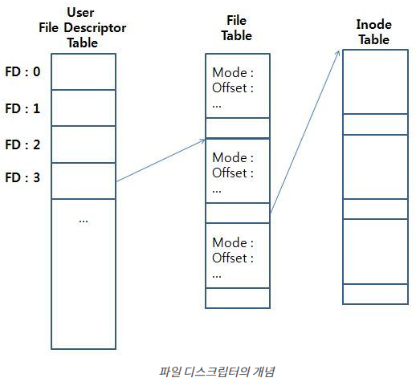

### 파일 디스크립터(File Descriptor)란?

[파일 디스크립터란 무엇인가?]

흔히 유닉스 시스템에서 모든 것은 파일이라고 한다. 일반적인 정규파일(Regular File)에서부터 디렉토리(Directory), 소켓(Socket), 파이프(PIPE), 블록 디바이스, 캐릭터 디바이스 등등 모든 객체들은 파일로써 관리된다. 유닉스 시스템에서 프로세스가 이 파일들을 접근할 때에 파일 디스크립터(File Descriptor)라는 개념을 이용한다.

리눅스와 유닉스 계열 운영체제에서 **파일 디스크립터(File Descriptor, FD)**는 프로세스가 **파일, 디렉토리, 소켓, 파이프 등 다양한 자원에 접근하기 위해 사용하는 정수 인덱스**이다.

운영체제 관점에서 “모든 것은 파일”이라는 철학이 관철되어 있으며, 일반 파일뿐만 아니라 터미널, 네트워크 소켓, 심지어는 디바이스까지 파일처럼 취급된다. 이 모든 객체들은 열릴 때마다 **커널 내부의 파일 테이블(File Table)**에 등록되고, 프로세스는 이를 참조할 수 있도록 **파일 디스크립터라는 정수 값**을 부여받는다.

프로그램이 프로세스로 메모리에서 실행을 시작 할 때, 기본적으로 할당되는 파일 디스크립터들이 있다. 바로 표준 입력(Standard Input), 표준 출력(Standard Output), 표준 에러(Standard Error)이다. 이 들에게 각각 0, 1, 2 라는 정수가 할당되며, POSIX 표준에서는 STDIN_FILENO, STDOUT_FILENO, STDERR_FILENO로 참조된다. 이 매크로는 <unistd.h> 헤더 파일에서 찾아 볼 수 있다. 0이 아닌 정수로 표현되는 파일 디스크립터는 0 ~ OPEN_MAX 까지의 값을 가질 수 있으며, OPEN_MAX 값은 플랫폼에 따라 다르다.

### 파일 디스크립터 구조와 동작 원리

[FD는 어떻게 구성되고 동작하는가?]

운영체제는 다음과 같은 구조로 FD를 관리한다.

```
[각 프로세스] 
    ↓
[FD 테이블 (File Descriptor Table)]
    ↓
[파일 테이블 (File Table)]
    ↓
[커널 VFS Layer → 실제 파일 시스템]
```



1. **FD Table**

   * 각 프로세스는 독립적인 FD 테이블을 가지고 있다.
   * FD는 단순한 인덱스로, 프로세스의 FD 테이블에서 파일 테이블을 가리키는 포인터로 동작한다.

2. **File Table**

   * 시스템 전체에서 공유되며, 실제 파일 객체에 대한 커널의 상태 정보(읽기/쓰기 위치, 파일 상태 등)를 포함한다.

3. **접근 방식**

   * 사용자는 FD 값을 통해 파일을 읽거나 쓸 수 있지만, 이 테이블을 직접 수정하지는 못하고 반드시 커널 API를 통해 접근한다 (`read()`, `write()`, `close()` 등).


프로세스는 맨 왼쪽의 FD 테이블을 갖고 있고, FD 테이블의 각 항목은 FD 플래그와 파일 테이블로의 포인터를 갖고 있다.
이 포인터를 이용해 시스템의 파일을 참조할 수 있다. 프로세스는 FD 테이블과 파일 테이블의 정보를 직접 고칠 수 없고, 반드시 커널을 통해서 수정해야 한다.


### 기본 파일 디스크립터

[프로세스가 시작할 때 자동으로 열리는 FD들]

파일 디스크립터가 단순히 숫자인 이유는 프로세스가 유지하고 있는 file descriptors 테이블의 인덱스이기 때문이다. 

프로그램이 실행되면 기본적으로 다음 세 개의 FD가 열려 있다

| 이름     | FD 값 | 설명                 |
| ------ | ---- | ------------------ |
| STDIN  | 0    | 표준 입력 (keyboard 등) |
| STDOUT | 1    | 표준 출력 (화면 등)       |
| STDERR | 2    | 표준 에러 출력           |

이들은 각각 `STDIN_FILENO`, `STDOUT_FILENO`, `STDERR_FILENO`라는 매크로로 참조된다.
(예를 들어, `System.in`, `System.out`, `System.err`는 자바에서 이와 매칭됌)
 
따라서 파일 오픈 or 소켓생성 시 부여되는 파일 디스크립터는 3부터 시작한다.

프로세스가 실행 중에 파일을 Open 하면 커널은 해당 프로세스의 파일 디스크립터 숫자 중에 사용하지 않는 가장 작은 값을 할당해 준다.
그 다음 프로세스가 열려있는 파일에 시스템 콜을 이용해서 접근할 때, 파일 디스크립터 값을 이용해 파일을 지칭할 수 있다. 

또한, FD의 최대값은 OPEN_MAX라는 값이다. 즉, 하나의 프로세스 당 최대 OPEN_MAX개의 파일을 열 수 있다. OPEN_MAX 값은 플랫폼에 따라 다르다.


### 파일 디스크립터 할당 방식

[FD는 어떻게 할당되는가?]

* 파일을 열면 `open()` 시스템 콜이 호출되고, 커널은 **현재 사용되지 않은 가장 작은 FD 정수 값**을 반환한다.

```c
int fd = open("file.txt", O_RDWR);
```

* `fd`는 이후 `read(fd, ...)`, `write(fd, ...)` 등의 시스템 호출에서 사용된다.
* 자바에서는 `FileInputStream`, `Socket`, `RandomAccessFile` 등 내부적으로 이런 시스템 콜을 감싼 방식으로 FD를 활용하고 있다.

### 네트워크 소켓과 FD

[소켓 프로그래밍에서의 파일 디스크립터]

일반 파일과 같이 소켓 네트워크 통신을 하는 경우에도 파일 디스크립터를 이용한다.
소켓 프로그래밍에서는 socket(), accept() 함수를 통해 소켓의 FD를 할당받을 수 있다.

```c
int sock_fd = socket(AF_INET, SOCK_STREAM, 0);
```

`sock_fd`는 네트워크 소켓을 가리키는 FD이며, `accept()`를 통해 새로운 클라이언트 접속이 생기면 또 다른 FD가 할당된다.

자바에서 `Socket socket = new Socket(...)` 혹은 `ServerSocket.accept()`를 사용할 때 내부적으로 FD를 요청하여 TCP 연결을 관리한다.

프로토콜 체계
- AF_INET : IPv4
- AF_INET6 : IPv6

데이터 전송 방식
- SOCK_STREAM : TCP 소켓
- SOCK_DGRAM : UDP 소켓

프로토콜 정보
 - 앞선 인자만으로 프로토콜을 정확히 특정할 수 없는 경우에만 명시함. 특정 가능한 경우 위의 예시처럼 0으로 작성해도 무관

### 파일 디스크립터가 중요한 이유

1. **리소스 누수(Leak) 문제 분석**

   * `FileInputStream`, `Socket`, `HttpURLConnection` 등은 내부적으로 FD를 할당받는다.
   * `close()`를 호출하지 않으면 FD가 계속 할당되어 **`Too many open files`** 에러가 발생할 수 있다.
   * → try-with-resources를 사용하는 이유이기도 하다.

2. **멀티 프로세스/스레드 환경에서 동시성 제어**

   * 각 프로세스는 독립된 FD 테이블을 갖지만, 자식 프로세스와 FD를 공유할 수도 있다 (`fork()`).
   * FD는 커널에서 관리되므로, 다중 스레드가 하나의 FD를 공유할 때 동기화 문제가 생길 수 있다.

3. **성능 및 병목 이슈 분석**

   * FD 수 제한(`ulimit -n`)을 초과하면 새로운 소켓 연결이 불가능하다.
   * 서버의 동시 접속 처리 능력을 FD 수치로 제한받을 수 있다.
   * → NIO 기반의 서버를 설계할 때 중요.

4. **디버깅 도구와의 연계**

   * `lsof -p {pid}`: 해당 프로세스가 열고 있는 FD 목록 확인 가능.
   * `/proc/{pid}/fd`: 리눅스에서는 실제 FD와 매핑된 파일을 확인 가능.
   * → 자바 애플리케이션에서 파일이 닫히지 않거나 소켓이 남아있는 문제를 추적할 수 있음.
