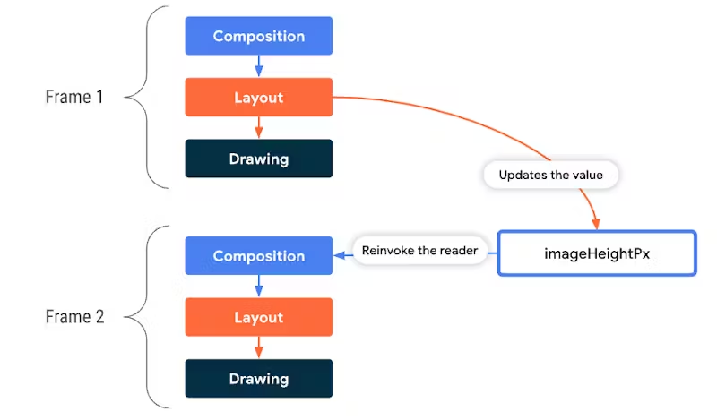

### 1. Compose가 UI를 그리는 3단계


Compose는 UI를 그릴 때 다음 3단계를 거친다:
1. Composition
    - "무엇을 그리는지 정의"
    - Composable가 실행되고, UI 트리(Composable -> SlotTable)이 생성
    - Compose Compiler가 Composable 함수들을 호출하여 SlotTable에 저장
    - 이후 입력 파라미터가 변했을 때만 `리컴포지션(Recomposition)` 발생 -> 변경된 부분만 다시 실행
2. Layout
    - "어떻게 배치할지 계산"
    - measure(측정)와 layout(배치) 단계로 나뉨
3. Draw
    - "실제로 화면에 그리기"
    - Layout 단계에서 계산된 위치와 크기를 바탕으로 실제 픽셀을 그리며, GPU와 Canvas에 렌더링

### 2. Recomposition(재구성)이란?



- Recomposition은 Compose가 UI를 다시 그리는 과정
- 입력 파라미터가 변경되었을 때, 해당 Composable 함수가 다시 실행되어 UI 트리를 업데이트
- 전체 UI를 다시 그리지 않고, 변경된 부분만 다시 실행하기 때문에 성능 최적화가 가능

### 3. Compose의 Stability란?

- Compose에서 Stability는 "이 객체가 변하지 않았음을 컴파일러와 런타임이 신뢰할 수 있는가?"를 의미
- 따라서 Stable한 `@Composable` 함수는 동일한 입력에 대해 동일한 출력을 제공하며, 불필요한 리컴포지션을 방지한다.

### 4. Stable과 Unstable의 차이

- Stable: Compose가 변경 여부를 추적할 수 있는 타입
  - 예: Int, String, @Stable 클래스, LazyListState, MutableState
  - 파라미터 참조가 같으면 리컴포지션 스킵, 내부 state 변화는 Compose가 자동 감지
- Unstable: Compose가 변경 여부를 신뢰할 수 없는 타입
  - 예: 일반 클래스, MutableList, MutableMap 등
  - Compose는 Unstable 객체를 사용하면 변경 여부를 추적하기 어려워 항상 리컴포지션이 발생

### 5. Compose Compiler와 Skipping

- Compose Compiler는 Composable 함수의 매개변수 타입을 분석하여 Stable인지 Unstable인지 판단
    - Stable한 타입은 재구성 시 성능 최적화를 위해 리컴포지션을 스킵 가능 (skippable)
    - Unstable한 타입은 변경 여부를 추적할 수 없으므로, 항상 리컴포지션이 발생 (non-skippable)
- Stable/immutable 타입은 skippable로 간주되어, 동일한 참조를 가지면 리컴포지션을 건너뜀
- Unstable 타입은 non-skippable로 간주되어, 참조가 같아도 내부 상태 변화가 있을 수 있으므로 항상 리컴포지션이 발생
- 따라서, @Stable이나 @Immutable 어노테이션을 사용하면 Compose Compiler에게 힌트를 주어 최적화를 유도

### 6. Compose Compiler와 Runtime Stability

```kotlin
data class User(
    val name: String,
    val age: Int
)

data class UnstableUser(
    var name: String,
    var age: Int
)
```

```kotlin
stable class User {
    stable val name: String
    stable val age: Int
    <runtime stability> = Stable
}

unstable class UnstableUser {
    stable var name: String
    stable var age: Int
    <runtime stability> = Unstable
}
```

- Compose Compiler는 각 타입의 runtime stability를 추론
- runtime stability = Stable -> 같은 참조라면 스킵 가능
- runtime stability = Unstable -> 참조가 같아도 항상 리컴포지션 발생

### 6. Stable/Immutable 어노테이션을 쓰지 않았을 때의 변화

#### 1. Users (일반 List 사용 -> Unstable)

```kotlin
data class Users(
    val name: String,
    val friend: List<String>
)

@Composable
fun UsersGreeting(users: Users) {
    Log.d("ComposeTest", "UsersGreeting recomposed with $users")
    Text("name: ${users.name}, friends: ${users.friend.size}")
}
```

```kotlin
unstable class Users {
    stable val name: String
    unstable val friend: List<String>
    <runtime stability> = Unstable
}

restartable skippable scheme("[androidx.compose.ui.UiComposable]") fun UsersGreeting(
    unstable users: Users
)
```

- List<String>은 불변성을 보장하지 않으므로 friend 필드가 Unstable 판정
- 따라서 Users 전체도 Unstable
- 함수 자체는 skippable이지만, users가 Unstable이므로 리컴포지션이 항상 발생

#### 2. UsersWithImmutable (ImmutableList 사용 -> Stable)

```kotlin
@Immutable
data class UsersWithImmutable(
    val name: String,
    val friends: ImmutableList<String>
)

@Composable
fun UsersImmutableGreeting(users: UsersWithImmutable) {
    Log.d("ComposeTest", "UsersImmutableGreeting recomposed with $users")
    Text("Hello ${users.name}, friends=${users.friends.size}")
}
```

```kotlin
stable class UsersWithImmutable {
    stable val name: String
    stable val friends: ImmutableList<String>
}

restartable skippable scheme("[androidx.compose.ui.UiComposable]") fun UsersImmutableGreeting(
    stable users: UsersWithImmutable
)
```

- ImmutableList는 불변성을 보장하므로 friends 필드가 Stable 판정
- 따라서 UsersWithImmutable 전체도 Stable
- 함수와 users 모두 skippable이므로, 참조가 같으면 리컴포지션 스킵 가능
- 즉, copy()로 새로운 인스턴스를 만들 때만 리컴포지션 발생

#### 3. AppState (NavHostController 사용 -> Unstable)

```kotlin
class AppState(
    val navController: NavHostController
) {
    val currentDestination: NavDestination?
        @Composable get() = navController
            .currentBackStackEntryAsState().value?.destination
}

@Composable
fun AppScaffold(appState: AppState) {
    Text("Destination: ${appState.currentDestination?.route}")
}
```

```kotlin
unstable class AppState {
    unstable val navController: NavHostController
    <runtime stability> = Unstable
}

fun <get-currentDestination>(
    unstable <this>: AppState
): NavDestination?
restartable skippable scheme("[androidx.compose.ui.UiComposable]") fun AppScaffold(
    unstable appState: AppState
)
```

- NavHostController는 Compose runtime이 안정성을 보장할 수 없는 타입 -> unstable
- 따라서 AppState 전체도 Unstable
- 함수는 skippable이지만, appState가 Unstable이므로 리컴포지션이 항상 발생

#### 4. AppStateWithStable (@Stable 어노테이션 사용 -> Stable)

```kotlin
@Stable
class AppStateWithStable(
    val navController: NavHostController
) {
    val currentDestination: NavDestination?
        @Composable get() = navController
            .currentBackStackEntryAsState().value?.destination
}

@Composable
fun AppScaffoldWithStable(appState: AppStateWithStable) {
    Text("Destination: ${appState.currentDestination?.route}")
}
```

```kotlin
stable class AppStateWithStable {
    unstable val navController: NavHostController
}

fun <get-currentDestination>(
    stable <this>: AppStateWithStable
): NavDestination?
restartable skippable scheme("[androidx.compose.ui.UiComposable]") fun AppScaffoldWithStable(
    stable appState: AppStateWithStable
)
```

- @Stable 어노테이션을 사용하여 AppStateWithStable 클래스가 Stable하다고 명시
- navController 필드는 Unstable이지만, 클래스 전체가 Stable로 간주
- 함수와 appState 모두 skippable이므로, 참조가 같으면 리컴지션 스킵 가능

### 7. @Stable은 언제 사용해야 하는가? (State Holder)

- 특징
  - 객체 참조는 그대로 두고, 내부에 Compose가 추적 가능한 상태(mutableStateOf, StateFlow.stateIn, LazyListState) 보관
  - Compose가 내부 상태가 바뀌면 알아서 invalidate하여 리컴포지션 발생
  - 문제는, AppState처럼 내부에 Unstable 타입(NavHostController)가 들어가 있으면 Unstable 판정
- 따라서 @Stable이 필요
  - AppState를 그대로 두면 unstable이므로, 매번 리컴포지션 발생
  - @Stable을 붙이면 `이 클래스 참조는 안정적이고, 내부 상태는 Compose가 추적 가능`하다고 보장 -> 참조 동일 시 리컴포지션 스킵 가능
- 사용 예시
  - 상태 홀더(State holder) 객체 = 여러 상태를 모아두고 앱 로직, 흐름 관리
    - AppState, UiState (MVI 패턴)
    - 내부는 계속 변하므로 @Immutable은 사용 불가

### 8. @Immutable은 언제 사용해야 하는가? (Value Object)

- 특징
  - 생성 이후 절대 변하지 않음 (불변)
  - 값이 바뀌면 copy()로 새로운 인스턴스 생성
  - 모든 프로퍼티가 val이고, 모두 Stable/Immutable 타입이어야 함
- @Immutable의 의미
  - 참조가 같으면 무조건 스킵 가능 (내부 상태 변화 없음)
  - copy()로 새로운 인스턴스 생성 시 참조가 바뀌므로 리컴지션 발생
- 사용 예시
  - 데이터 모델(Value Object) = API 응답, DB 엔티티, 화면에 표시할 데이터
    - UI에서 보여줄 데이터일 뿐, 상태 추적은 필요 없음

### 9. @Stable vs @Immutable 차이 정리

| 구분 | @Stable                                        | @Immutable |
|------|------------------------------------------------|------------|
| 의미 | 상태가 변할 수 있음, Compose가 추적 가능                    | 절대 변하지 않음, 추적 불필요 |
| 내부 추적 비용 | 있음 (Snapshot 관찰 필요)                            | 없음 |
| 리컴포지션 조건 | 참조 동일 → 스킵, 내부 state 바뀌면 invalidate            | 참조 동일 → 무조건 스킵 (copy() 시에만 발생) |
| 비교 방식 | 내부 state까지 관찰해야 하므로 equals() 대신 Snapshot 기반 추적 | 참조 동일성(`===`)만 확인 |
| 대표 용도 | State Holder (AppState, UiState 등)             | Value Object (User, DTO, Entity 등) |